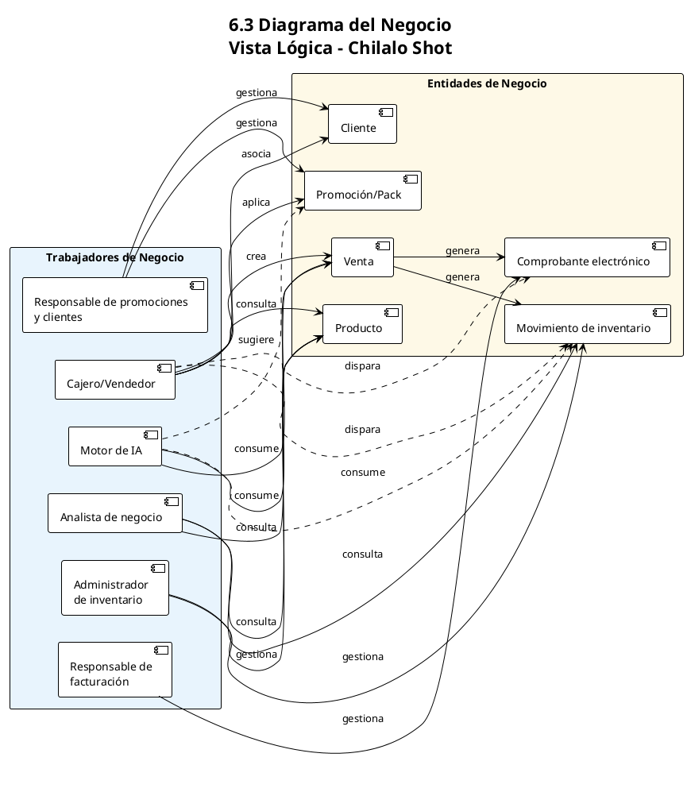

# FICHA 03 - ANÁLISIS DE CASOS DE USO DE NEGOCIO
## Sistema Web y App Móvil con IA para Gestión Integral de Licorería
### Proyecto: Chilalo Shot

---

## 2. INTRODUCCIÓN

### 2.1 Propósito

El presente documento tiene como propósito **definir y especificar los casos de uso de negocio (CUN)** del Sistema Web y App Móvil con Inteligencia Artificial para la Gestión Integral de la licorería "Chilalo Shot". Este análisis permite:

- Identificar y documentar los procesos de negocio que el sistema debe soportar desde la perspectiva de los actores involucrados.
- Establecer el alcance funcional desde la vista del dominio de negocio, antes de derivar requisitos técnicos.
- Servir como base para el diseño de la vista lógica (trabajadores y entidades de negocio) y la posterior especificación de casos de uso del sistema.
- Facilitar la validación con el cliente (dueño/empleado) y asegurar que la solución cubre las necesidades operativas reales de la licorería.

### 2.2 Alcance

**Alcance del documento:**

- **Incluye:** Actores de negocio, casos de uso de negocio (CUN), restricciones y riesgos tecnológicos, especificaciones CUN (propósito, descripción, flujo de trabajo, requerimientos especiales), vista lógica (trabajadores de negocio, entidades de negocio, diagramas de negocio y de realización).
- **Excluye:** Casos de uso del sistema (CUS) detallados, diseño de interfaz de usuario (mockups), especificación de APIs y detalles de implementación técnica.
- **Contexto:** Licorería "Chilalo Shot" en Piura, operando con 1-2 empleados; procesos de venta, inventario, facturación electrónica, promociones, reportes y uso de IA para recomendaciones y predicción.

**Alcance del negocio cubierto:**

- Gestión de ventas (punto de venta).
- Control de inventario y alertas.
- Emisión de comprobantes electrónicos (SUNAT).
- Gestión de promociones y packs.
- Gestión de clientes y fidelización.
- Reportes y analytics.
- Uso de inteligencia artificial (recomendaciones, predicción de demanda).

---

## 3. RESTRICCIONES Y RIESGOS TECNOLÓGICOS

### 3.1 Restricciones

| Restricción | Descripción |
|-------------|-------------|
| **R01** | **Tiempo de desarrollo:** El proyecto debe completarse en 14 semanas con un desarrollador único (practicante). El alcance se limita a funcionalidades core; la app móvil completa queda como opcional en fases posteriores. |
| **R02** | **Integración SUNAT:** El sistema depende de la disponibilidad y estabilidad de las APIs de SUNAT y del OSE. El cliente debe contar con certificado digital y cuenta OSE configurada. Cualquier cambio normativo puede requerir ajustes en el sistema. |
| **R03** | **Presupuesto y recursos:** Proyecto académico con presupuesto mínimo (aprox. USD 30-122). Uso de herramientas gratuitas/educativas, hardware propio y servicios cloud en tier gratuito. No hay QA dedicado ni soporte 24/7. |

### 3.2 Riesgos Tecnológicos

| Riesgo | Descripción |
|--------|-------------|
| **RT01** | **Problemas de integración con SUNAT/OSE:** Fallos en la API del OSE o cambios en normativas pueden retrasar la facturación electrónica. Mitigación: prototipo temprano, pruebas en ambiente SUNAT de pruebas y consideración de múltiples proveedores OSE. |
| **RT02** | **Conectividad y modo offline:** El POS requiere modo offline básico; la sincronización y emisión de comprobantes dependen de internet. Fallos de conectividad pueden afectar operación. Mitigación: diseño offline-first con cola de sincronización y manejo robusto de errores. |
| **RT03** | **Datos históricos para IA:** Los modelos de recomendación y predicción de demanda requieren datos históricos de ventas. En los primeros meses el rendimiento de la IA será limitado hasta acumular datos reales. Mitigación: modelos con datos sintéticos iniciales y mejora continua con datos reales. |

---

## 4. VISITAS DE CASOS DE USO DE NEGOCIO

### 4.1 Lista de actores de Negocio

| Item | Actor | Descripción |
|------|-------|-------------|
| 1 | **Dueño/Administrador de la licorería** | Persona que toma decisiones del negocio, configura el sistema, gestiona inventario, promociones, reportes y facturación. Usuario principal con rol Administrador. |
| 2 | **Vendedor/Empleado** | Persona que atiende en mostrador, realiza ventas mediante POS, aplica promociones y consulta productos y stock. Rol Vendedor (puede coincidir con el dueño en negocios de 1 persona). |
| 3 | **Cliente** | Persona que compra en la licorería. Recibe atención, comprobantes electrónicos y puede participar en programa de fidelización. Actor externo. |
| 4 | **SUNAT (sistema externo)** | Entidad que regula y recibe los comprobantes electrónicos. El sistema debe enviar boletas/facturas según normativa vigente. Actor externo/sistema. |
| 5 | **Sistema de IA** | Componente que genera recomendaciones de productos, predicción de demanda y sugerencias de promociones. Actor no humano dentro del sistema. |

### 4.2 Lista de casos de uso de Negocio

| Item | Caso de uso | Descripción | Tipo |
|------|-------------|-------------|------|
| 1 | **Realizar venta en punto de venta (POS)** | Registrar la venta de productos al cliente: búsqueda de productos, aplicación de promociones, cálculo de total, pago y emisión de comprobante (ticket o boleta/factura electrónica). | Esencial |
| 2 | **Gestionar inventario** | Mantener el catálogo de productos (altas, bajas, modificaciones), stock mínimo/máximo, fechas de vencimiento y recibir alertas de stock bajo y productos próximos a vencer. | Esencial |
| 3 | **Emitir comprobantes electrónicos** | Emitir boletas y facturas electrónicas integradas con SUNAT mediante OSE, generando XML/PDF y enviando resúmenes (RCB) según normativa. | Esencial |
| 4 | **Gestionar promociones y packs** | Crear y modificar promociones (descuentos, 2x1, packs), asociarlas a productos o categorías y aplicar su aplicación automática en el POS. | Esencial |
| 5 | **Gestionar clientes y fidelización** | Registrar clientes, historial de compras, puntos y canje por descuentos o beneficios dentro del programa de fidelización. | Esencial |
| 6 | **Consultar reportes y analytics** | Visualizar dashboard con métricas de ventas, inventario y rentabilidad; reportes por período; exportación a Excel/PDF; e insights generados por IA. | Esencial |
| 7 | **Obtener recomendaciones y predicciones de IA** | Recibir recomendaciones de productos en el POS, predicción de demanda para compras, sugerencias de promociones y optimización de inventario basadas en patrones. | Esencial |

### 4.3 Diagrama de caso de uso de Negocio

El diagrama organiza **actores** y **casos de uso** por categorías para una lectura más clara.

#### Actores (ordenados por tipo)

| Tipo        | Actor                    | Descripción breve                                                                 |
|------------|---------------------------|------------------------------------------------------------------------------------|
| Interno    | Dueño/Administrador       | Configura y gestiona inventario, facturación, promociones, clientes y reportes.    |
| Interno    | Vendedor/Empleado         | Realiza ventas en POS y gestiona clientes (consulta/registro básico).             |
| Externo    | Cliente                   | Participa en la venta (recibe productos y comprobantes).                          |
| Externo    | SUNAT                     | Recibe comprobantes electrónicos y resúmenes según normativa.                      |
| Sistema    | Sistema de IA (interno)   | Soporta recomendaciones, predicción de demanda y insights en reportes.           |

#### Casos de uso agrupados por categoría

| Categoría          | Casos de uso                                                                 |
|--------------------|-------------------------------------------------------------------------------|
| **Operaciones**    | Realizar venta en POS, Gestionar inventario, Emitir comprobantes electrónicos  |
| **Gestión comercial** | Gestionar promociones y packs, Gestionar clientes y fidelización          |
| **Análisis e IA**  | Consultar reportes y analytics, Obtener recomendaciones y predicciones de IA  |

#### Relaciones actor ↔ caso de uso

- **Dueño/Administrador** → Gestionar inventario, Emitir comprobantes electrónicos, Gestionar promociones y packs, Gestionar clientes y fidelización, Consultar reportes y analytics.
- **Vendedor/Empleado** → Realizar venta en POS, Gestionar clientes y fidelización.
- **Cliente** → Realizar venta en POS.
- **SUNAT** → Emitir comprobantes electrónicos.
- **Sistema de IA** → Realizar venta en POS, Gestionar inventario, Gestionar promociones y packs, Consultar reportes y analytics, Obtener recomendaciones y predicciones de IA.

#### Inclusiones y extensiones

- **Realizar venta en POS** `<<include>>` aplicación de **Gestionar promociones y packs**; `<<extend>>` opcional a **Emitir comprobantes electrónicos**.
- **Consultar reportes y analytics** `<<include>>` **Obtener recomendaciones y predicciones de IA**.

#### Diagrama PlantUML

Copie el contenido del archivo `FICHA_03_Diagrama_CUN.puml` en [plantuml.com](https://www.plantuml.com/plantuml/uml) para generar el diagrama. El diagrama usa dirección **top to bottom**, actores en la parte superior y casos de uso agrupados en tres bloques: **Operaciones**, **Gestión comercial** y **Análisis e IA**.

---

## 5. ESPECIFICACIÓN DE CASOS DE USO DE NEGOCIO - CUN (POR CADA CUN)

### 5.1 ESPECIFICACIÓN DE CUN: "Realizar venta en punto de venta (POS)"

#### 5.2 PROPÓSITO

Permitir al vendedor o al dueño registrar una venta de manera rápida y precisa: seleccionar productos, aplicar promociones automáticas, registrar forma de pago y entregar comprobante (ticket y/o boleta/factura electrónica) al cliente, reduciendo el tiempo de atención y los errores de cálculo.

#### I. REFERENCIAS

- Acta de Constitución del Proyecto (alcance: POS, facturación, promociones).
- FICHA_02: Necesidades 1, 4, 6; Características POS y promociones.
- Normativa SUNAT para comprobantes electrónicos.

#### 5.3 DESCRIPCIÓN DEL CASO DE USO DE NEGOCIO

El vendedor atiende al cliente en el mostrador. Utiliza el POS para buscar productos (por nombre, código de barras o categoría), agregarlos al carrito de venta. El sistema aplica automáticamente las promociones vigentes y calcula subtotal, descuentos e IGV. El vendedor registra la forma de pago (efectivo, tarjeta, transferencia) y, si corresponde, el cliente para boleta/factura. El sistema genera el comprobante (ticket y/o electrónico) y actualiza el inventario. Opcionalmente el sistema sugiere productos complementarios (IA).

#### 5.4 FLUJO DE TRABAJO

1. El vendedor inicia una nueva venta en el POS.
2. El vendedor agrega productos al carrito (búsqueda por código, nombre o categoría).
3. El sistema muestra precio unitario, cantidad y subtotal por ítem; aplica promociones y packs automáticamente.
4. El sistema calcula total a pagar (subtotal, descuentos, IGV).
5. (Opcional) El sistema muestra recomendaciones de productos (IA); el vendedor puede agregar más ítems.
6. El vendedor registra la forma de pago y el monto recibido (en efectivo el sistema calcula vuelto).
7. Si el cliente requiere comprobante electrónico, el vendedor registra datos del cliente (DNI/RUC, nombre) y el sistema emite boleta o factura según tipo de documento.
8. El sistema registra la venta, actualiza stock y entrega ticket y/o comprobante electrónico al cliente.
9. (Excepciones: producto sin stock, error de conexión con SUNAT, pago insuficiente; se documentan en CUS.)

#### 5.5 REQUERIMIENTOS ESPECIALES

**A. FACILIDAD DE USO**  
- Interfaz intuitiva para uso con 1-2 personas; tiempo objetivo de venta 30-45 segundos.  
- Búsqueda rápida de productos y atajos de teclado para operaciones frecuentes.

**B. CONFIABILIDAD**  
- Transacción atómica: venta registrada solo si inventario y comprobante (cuando aplique) se procesan correctamente.  
- En modo offline, ventas se almacenan localmente y se sincronizan al recuperar conexión; comprobantes electrónicos se emiten al estar en línea.

**C. SOPORTE**  
- Mensajes claros ante errores (stock insuficiente, fallo SUNAT).  
- Capacitación básica al vendedor y documentación de usuario del POS.

---

### 5.1 ESPECIFICACIÓN DE CUN: "Gestionar inventario"

#### 5.2 PROPÓSITO

Mantener el catálogo de productos y el stock en tiempo real, con alertas de stock bajo y productos próximos a vencer, para reducir desabastecimiento y pérdidas por vencimiento.

#### 5.3 DESCRIPCIÓN DEL CASO DE USO DE NEGOCIO

El dueño o administrador registra y actualiza productos (nombre, categoría, precio, código de barras, stock mínimo/máximo, fecha de vencimiento). El sistema actualiza el stock automáticamente con cada venta y con movimientos manuales (ajustes, ingresos por compra). El sistema genera alertas de stock bajo y productos próximos a vencer. Opcionalmente la IA sugiere cantidades a comprar (predicción de demanda).

#### 5.4 FLUJO DE TRABAJO

1. El administrador accede al módulo de inventario.
2. Puede crear, editar o desactivar productos y definir stock mínimo/máximo y vencimientos.
3. El sistema actualiza el stock con cada venta registrada en el POS.
4. El administrador puede registrar ingresos de mercadería (compras) y ajustes de inventario.
5. El sistema muestra alertas de productos con stock por debajo del mínimo y productos próximos a vencer.
6. (Opcional) El sistema muestra sugerencias de compra basadas en predicción de demanda (IA).

#### 5.5 REQUERIMIENTOS ESPECIALES

**A. FACILIDAD DE USO**  
- Búsqueda y filtros por categoría, nombre, código; listado claro de alertas.

**B. CONFIABILIDAD**  
- Consistencia entre stock en POS y en módulo de inventario; precisión objetivo >98%.

**C. SOPORTE**  
- Historial de movimientos de inventario para auditoría y soporte.

---

### 5.1 ESPECIFICACIÓN DE CUN: "Emitir comprobantes electrónicos"

#### 5.2 PROPÓSITO

Cumplir con la normativa SUNAT emitiendo boletas y facturas electrónicas a través del OSE, generando XML y PDF y enviando resúmenes diarios (RCB) cuando corresponda.

#### 5.3 DESCRIPCIÓN DEL CASO DE USO DE NEGOCIO

Cuando una venta requiere comprobante electrónico, el sistema genera el XML según formato UBL 2.1, lo firma con el certificado digital del contribuyente y lo envía al OSE, que lo transmite a SUNAT. El sistema almacena el CDR y genera el PDF para entrega al cliente. Para boletas se puede generar resumen diario (RCB) según normativa.

#### 5.4 FLUJO DE TRABAJO

1. Desde el POS (o módulo de ventas) se solicita emisión de boleta o factura para la venta registrada.
2. El sistema construye el comprobante en formato UBL 2.1, firma con certificado digital y envía al OSE.
3. El OSE transmite a SUNAT; el sistema recibe y almacena la constancia de recepción (CDR).
4. El sistema genera el PDF del comprobante y lo pone a disposición para impresión o envío al cliente.
5. En el cierre del día, el sistema puede generar y enviar el resumen de boletas (RCB) según normativa.

#### 5.5 REQUERIMIENTOS ESPECIALES

**A. FACILIDAD DE USO**  
- Configuración guiada de certificado y OSE; mensajes claros si hay rechazo de SUNAT.

**B. CONFIABILIDAD**  
- Reintentos ante fallos temporales del OSE/SUNAT; registro de estado de cada comprobante.

**C. SOPORTE**  
- Documentación de requisitos SUNAT y procedimientos de configuración con el OSE.

---

### 5.1 ESPECIFICACIÓN DE CUN: "Gestionar promociones y packs"

**5.2 PROPÓSITO:** Definir y mantener promociones (descuentos, 2x1, packs) para aumentar ventas y fidelizar clientes.  
**5.3 DESCRIPCIÓN:** El administrador crea promociones por producto, categoría o pack; define vigencia y condiciones. El POS aplica automáticamente las reglas en cada venta. La IA puede sugerir promociones según patrones.  
**5.4 FLUJO:** Crear/editar promoción → definir productos y reglas → activar; en venta el sistema aplica y muestra descuento.  
**5.5 REQUERIMIENTOS:** A) Interfaz clara para crear packs y descuentos. B) Cálculo correcto y trazabilidad. C) Documentación de tipos de promoción.

---

### 5.1 ESPECIFICACIÓN DE CUN: "Gestionar clientes y fidelización"

**5.2 PROPÓSITO:** Registrar clientes, historial de compras y puntos para programa de fidelización.  
**5.3 DESCRIPCIÓN:** Se registran clientes (DNI/RUC, nombre, contacto). Cada venta acumula puntos; el cliente puede canjear por descuentos o beneficios.  
**5.4 FLUJO:** Alta/edición de cliente → en venta se asocia cliente y se acumulan puntos → consulta de puntos y canje.  
**5.5 REQUERIMIENTOS:** A) Búsqueda rápida de cliente en POS. B) Integridad de puntos y movimientos. C) Reglas de canje documentadas.

---

### 5.1 ESPECIFICACIÓN DE CUN: "Consultar reportes y analytics"

**5.2 PROPÓSITO:** Dar visibilidad del negocio mediante dashboard, reportes de ventas/inventario/rentabilidad e insights de IA.  
**5.3 DESCRIPCIÓN:** El dueño/administrador consulta métricas en tiempo real, reportes por período y exportación Excel/PDF; opcionalmente insights automáticos de IA.  
**5.4 FLUJO:** Acceso al módulo de reportes → selección de período y tipo → visualización y exportación.  
**5.5 REQUERIMIENTOS:** A) Gráficos claros y filtros intuitivos. B) Datos consistentes con ventas e inventario. C) Documentación de indicadores.

---

### 5.1 ESPECIFICACIÓN DE CUN: "Obtener recomendaciones y predicciones de IA"

**5.2 PROPÓSITO:** Apoyar decisiones con recomendaciones de productos en venta, predicción de demanda y sugerencias de promociones.  
**5.3 DESCRIPCIÓN:** El motor de IA consume historial de ventas e inventario para sugerir productos complementarios en el POS, cantidades a comprar y promociones efectivas.  
**5.4 FLUJO:** Durante la venta se muestran recomendaciones; en inventario se muestran sugerencias de compra; en promociones se sugieren ofertas.  
**5.5 REQUERIMIENTOS:** A) Sugerencias visibles pero no intrusivas. B) Modelos validados y sin sesgos críticos. C) Explicación básica de criterios de IA para el usuario.

---

## 6. VISTA LÓGICA

### 6.1 Lista de trabajadores de Negocio

| Item | Trabajador del Negocio | Descripción |
|------|------------------------|-------------|
| 1 | **Cajero/Vendedor** | Trabajador que atiende al cliente en el mostrador, opera el POS, aplica promociones y entrega comprobantes. Representa el rol operativo de venta. |
| 2 | **Administrador de inventario** | Trabajador responsable de mantener el catálogo de productos, stock mínimo/máximo, fechas de vencimiento, ingresos y ajustes. Puede ser el dueño o una persona designada. |
| 3 | **Responsable de facturación** | Trabajador que vela por la correcta emisión de comprobantes electrónicos, configuración con OSE/SUNAT y resolución de incidencias con SUNAT. Normalmente el dueño o administrador. |
| 4 | **Responsable de promociones y clientes** | Trabajador que define promociones, packs y reglas del programa de fidelización y da de alta/actualiza clientes. Suele ser el dueño o administrador. |
| 5 | **Analista de negocio** | Trabajador que consulta reportes, dashboard e insights de IA para tomar decisiones de compra, precios y promociones. Coincide con el dueño/administrador. |
| 6 | **Motor de recomendaciones y predicción (IA)** | Componente automatizado que genera recomendaciones de productos, predicción de demanda y sugerencias de promociones. Trabajador no humano. |

### 6.2 Lista de entidades de Negocio

| Item | Entidad del Negocio | Descripción |
|------|---------------------|-------------|
| 1 | **Producto** | Ítem vendible: nombre, categoría, precio, código de barras, stock actual, stock mínimo/máximo, fecha de vencimiento, estado (activo/inactivo). |
| 2 | **Venta** | Transacción de venta: fecha/hora, ítems (producto, cantidad, precio, descuento), subtotal, descuentos globales, IGV, total, forma de pago, cliente asociado (opcional), comprobante emitido (opcional). |
| 3 | **Cliente** | Persona o empresa que compra: identificador (DNI/RUC), nombre, contacto, historial de compras, puntos de fidelización, segmento. |
| 4 | **Promoción/Pack** | Regla comercial: tipo (descuento %, monto fijo, 2x1, pack), productos o categorías afectados, vigencia, condiciones. |
| 5 | **Comprobante electrónico** | Boleta o factura electrónica: número, tipo, serie, XML, CDR, PDF, estado (aceptado/rechazado/pendiente), vinculación a venta. |
| 6 | **Movimiento de inventario** | Registro de cambio de stock: producto, tipo (venta, compra, ajuste), cantidad, fecha, referencia (venta o documento). |

### 6.3 Diagrama del Negocio

Descripción de la vista lógica del negocio (equivalent to a Business Object Model / Domain Model):

- **Cajero/Vendedor** utiliza **Producto** (consulta precios y stock) y **Promoción/Pack** (aplicación en venta); crea **Venta** y puede asociar **Cliente**; dispara generación de **Comprobante electrónico** y **Movimiento de inventario**.
- **Administrador de inventario** gestiona **Producto** y **Movimiento de inventario**.
- **Responsable de facturación** gestiona **Comprobante electrónico** y su envío a SUNAT.
- **Responsable de promociones y clientes** gestiona **Promoción/Pack** y **Cliente**.
- **Analista de negocio** consulta **Venta**, **Producto**, **Movimiento de inventario** y reportes derivados.
- **Motor de IA** consume **Venta** e **inventario** (Producto, Movimiento) para producir recomendaciones y predicciones; puede sugerir cambios en **Promoción/Pack**.

**Diagrama PlantUML (6.3 - Diagrama del Negocio):**

*Archivo:* `FICHA_03_Vista_Logica_6_3_Diagrama_Negocio.puml` — copie su contenido en [plantuml.com](https://www.plantuml.com/plantuml/uml).

### 6.4 Diagrama de Realización de negocio (por cada caso de uso de Negocio)

**Archivo PlantUML:** `FICHA_03_Vista_Logica_6_4_Realizacion.puml` — contiene 5 diagramas (uno por CUN). En [plantuml.com](https://www.plantuml.com/plantuml/uml) pegue el contenido y avance con "Next" para ver cada diagrama, o seccione cada bloque `@startuml` … `@enduml` por separado.

---

**CUN: Realizar venta en POS**

- **Trabajadores:** Cajero/Vendedor (principal), Motor de IA (recomendaciones).
- **Entidades:** Producto (consulta), Promoción/Pack (aplicación), Venta (creación), Cliente (asociación opcional), Comprobante electrónico (si aplica), Movimiento de inventario (por cada ítem).
- **Flujo:** Cajero consulta Producto y Promoción/Pack → arma Venta → (opcional) asocia Cliente → sistema crea Venta, Comprobante electrónico (si aplica) y Movimientos de inventario; Motor IA sugiere productos.

**CUN: Gestionar inventario**

- **Trabajadores:** Administrador de inventario, Motor de IA (predicción).
- **Entidades:** Producto, Movimiento de inventario.
- **Flujo:** Administrador crea/actualiza Producto y registra Movimientos; sistema muestra alertas; Motor IA sugiere compras.

**CUN: Emitir comprobantes electrónicos**

- **Trabajadores:** Responsable de facturación (configuración); Cajero dispara emisión desde venta.
- **Entidades:** Venta, Comprobante electrónico, Cliente (datos fiscales).
- **Flujo:** A partir de Venta y datos de Cliente, sistema genera y envía Comprobante electrónico a SUNAT vía OSE.

**CUN: Gestionar promociones y packs / Gestionar clientes y fidelización / Consultar reportes / Recomendaciones y predicciones IA**

- Realizaciones análogas: se asignan los trabajadores y entidades listados en 6.1 y 6.2 según cada CUN (Responsable de promociones y clientes ↔ Promoción/Pack y Cliente; Analista de negocio ↔ Venta, Producto, reportes; Motor IA ↔ Venta, Producto, Movimiento, Promoción/Pack).

---

**Preparado por:** Idat  
**Página :** 4 de 6  
**Fecha:** [Fecha]  
**Versión:** 1.0  
**Proyecto:** Chilalo Shot - Sistema Web y App Móvil con IA para Gestión Integral de Licorería
