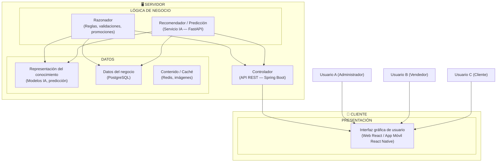

# Desarrollo de Sistemas de Información
## FPIPS-106 Modelo de Análisis
### Versión 1.0

**Nombre del Proyecto:** Sistema Web y App Móvil con IA para Gestión Integral de Licorería — Chilalo Shot
**Código de Proyecto:** PROY-LICOR-PIURA-2025-001
**Cliente:** Chilalo Shot — Piura, Perú

---

| Número | Apellidos y Nombres |
|--------|---------------------|
| 1 | |
| 2 | |
| 3 | |

---

## HISTORIAL DE CAMBIOS DEL DOCUMENTO

| VERSIÓN | FECHA DE REVISIÓN | ACTUALIZADO POR | CARGO | DESCRIPCIÓN BREVE |
|---------|-------------------|-----------------|------|-------------------|
| 001 | 24-feb-2025 | | | Versión inicial según plantilla FPIPS-106 |

---

## 1. Aplicación Móvil y Web

### 1.1. Propósito

Definir el modelo de análisis del **Sistema de Gestión de Licorería con IA** para Chilalo Shot, estableciendo los requerimientos funcionales y no funcionales, los casos de uso, las reglas de negocio y los mensajes de las aplicaciones **Web** (React) y **Móvil** (React Native), con el fin de servir como base común entre stakeholders y el equipo de desarrollo para el diseño e implementación del sistema.

### 1.2. Alcance

- **Sistema Web (React):** Módulos de administración (usuarios, roles), inventario (productos, entradas, alertas), facturación (parámetros, OSE), promociones y packs, reportes y dashboard, fidelización de clientes, e integración con el servicio de IA (predicción, recomendaciones).
- **App Móvil (React Native):** Punto de venta en mostrador y en campo: búsqueda de productos (código de barras, nombre), carrito de venta, aplicación de promociones, formas de pago, emisión de ticket y comprobante electrónico, modo offline y sincronización.
- **Actores:** Dueño/Administrador, Vendedor/Empleado, Cliente, SUNAT, Sistema de IA.
- **Fuera de alcance en esta versión:** Diseño físico de base de datos, código fuente y pruebas de aceptación (documentados en otras fichas).

---

## 2. Objetivos del Proyecto

El proyecto tiene como objetivos reducir el tiempo de venta de 3-5 minutos a 30-45 segundos mediante una app móvil POS integrada; garantizar el cumplimiento del 100% con la normativa de facturación electrónica SUNAT mediante integración con OSE; lograr una precisión de inventario superior al 98% con actualización automática y alertas de stock bajo y productos por vencer; ofrecer reportes y dashboard para la toma de decisiones y, con IA, recomendaciones y predicción de demanda; y soportar la operación temporal sin conexión en la app móvil con sincronización posterior.

---

## 3. Requerimientos Funcionales

### 3.1. Requerimientos Funcionales para la Aplicación Móvil

| Cod. Req. | Nombre Requerimiento | Descripción |
|-----------|----------------------|-------------|
| RF-MOV-01 | Registrar venta | Permitir búsqueda de productos (código de barras, nombre), agregar ítems al carrito, aplicar promociones automáticas, calcular totales y registrar la venta con forma de pago. |
| RF-MOV-02 | Aplicar forma de pago | Soportar múltiples formas de pago (efectivo, tarjeta, transferencia, y otras configuradas); registrar monto y calcular vuelto si aplica. |
| RF-MOV-03 | Emitir comprobante | Emitir boleta o factura electrónica desde la app; generar ticket e integrar con SUNAT vía OSE. |
| RF-MOV-04 | Operar en modo offline | Permitir ventas básicas sin conexión; almacenar transacciones en cola y sincronizar al restablecer internet. |
| RF-MOV-05 | Consultar stock y alertas | Consultar disponibilidad de productos y visualizar alertas de stock bajo desde la app móvil. |
| RF-MOV-06 | Registrar cliente y fidelización | Identificar cliente en la venta; acumular puntos y permitir canje según reglas del programa de fidelización. |
| RF-MOV-07 | Recomendaciones IA | Mostrar sugerencias de productos complementarios durante la venta basadas en historial (cuando el servicio de IA esté disponible). |

### 3.2. Requerimientos Funcionales para la Aplicación Web

| Cod. Req. | Nombre Requerimiento | Descripción |
|-----------|----------------------|-------------|
| RF-WEB-01 | Autenticación y sesión | Iniciar sesión y cerrar sesión con usuario y contraseña; control de roles (Administrador, Vendedor) y tiempo de expiración de sesión. |
| RF-WEB-02 | Gestionar usuarios y roles | Alta, baja y edición de usuarios; asignación de roles (Administrador, Vendedor) y permisos diferenciados. |
| RF-WEB-03 | Gestionar productos | Alta, edición y baja de productos; categorías, código de barras, precios, stock mínimo/máximo, fechas de vencimiento. |
| RF-WEB-04 | Gestionar inventario | Registrar entradas de stock, consultar movimientos, configurar alertas de stock bajo y productos próximos a vencer. |
| RF-WEB-05 | Facturación electrónica | Configurar OSE y certificado digital; emitir boletas y facturas; consultar estado de envío a SUNAT; generación de XML y PDF. |
| RF-WEB-06 | Promociones y packs | Crear y editar promociones (descuento %, monto fijo, 2x1, packs) y fechas de vigencia; aplicación automática en app móvil. |
| RF-WEB-07 | Reportes y dashboard | Dashboard con métricas (ventas del día/semana/mes, productos más vendidos); reportes de inventario y ventas; exportación a Excel/PDF. |
| RF-WEB-08 | Fidelización | Registrar clientes; configurar reglas de puntos y canje; consultar historial de puntos y canjes. |
| RF-WEB-09 | Predicción de demanda (IA) | Visualizar alertas de productos que se agotarán y sugerencias de cantidad a comprar basadas en tendencias (servicio de IA). |

### 3.3. Inventario de Casos de Uso de la Aplicación Móvil

| Cod. CU | Nombre Caso de Uso | RF | Descripción |
|---------|--------------------|-----|-------------|
| CU-MOV-01 | Registrar venta | RF-MOV-01 | Flujo completo: búsqueda de productos, carrito, promociones, pago y comprobante. |
| CU-MOV-02 | Aplicar forma de pago | RF-MOV-02 | Seleccionar y registrar forma de pago; cálculo de vuelto. |
| CU-MOV-03 | Emitir boleta electrónica | RF-MOV-03 | Generar y enviar boleta a SUNAT; compartir comprobante digital. |
| CU-MOV-04 | Emitir factura electrónica | RF-MOV-03 | Generar y enviar factura a SUNAT con datos del cliente. |
| CU-MOV-05 | Operar en modo offline | RF-MOV-04 | Realizar ventas sin conexión; sincronizar después. |
| CU-MOV-06 | Consultar alertas de stock | RF-MOV-05 | Ver productos con stock bajo o próximos a vencer. |
| CU-MOV-07 | Registrar cliente en venta | RF-MOV-06 | Identificar cliente para acumular puntos o canje. |
| CU-MOV-08 | Obtener recomendaciones IA | RF-MOV-07 | Ver sugerencias de productos en pantalla de venta. |

### 3.4. Inventario de Casos de Uso de la Aplicación Web

| Cod. CU | Nombre Caso de Uso | RF | Descripción |
|---------|--------------------|-----|-------------|
| CU-WEB-01 | Iniciar sesión / Cerrar sesión | RF-WEB-01 | Autenticación y cierre de sesión seguros. |
| CU-WEB-02 | Gestionar usuarios y roles | RF-WEB-02 | Alta, edición y asignación de roles. |
| CU-WEB-03 | Gestionar productos | RF-WEB-03 | CRUD de productos y categorías. |
| CU-WEB-04 | Registrar entrada de stock | RF-WEB-04 | Registrar entradas y ajustes de inventario. |
| CU-WEB-05 | Consultar alertas de stock | RF-WEB-04 | Ver alertas de stock bajo y vencimientos. |
| CU-WEB-06 | Emitir boleta/factura electrónica | RF-WEB-05 | Emisión y consulta de comprobantes; configuración OSE. |
| CU-WEB-07 | Crear promociones y packs | RF-WEB-06 | Definir promociones y vigencia. |
| CU-WEB-08 | Ver dashboard | RF-WEB-07 | Métricas clave y gráficos. |
| CU-WEB-09 | Generar y exportar reportes | RF-WEB-07 | Reportes por período; exportar Excel/PDF. |
| CU-WEB-10 | Gestionar clientes y fidelización | RF-WEB-08 | Registro de clientes; puntos y canje. |
| CU-WEB-11 | Predicción de demanda (IA) | RF-WEB-09 | Visualizar predicciones e insights de IA. |

### 3.5. Caso de Uso – "Registrar venta"

#### 3.5.1. Descripción del Caso de Uso

El vendedor utiliza la aplicación móvil para atender una venta: busca productos por código de barras (cámara del dispositivo) o nombre, agrega ítems al carrito, el sistema aplica automáticamente las promociones vigentes, el vendedor selecciona la forma de pago, registra el cobro y puede compartir o imprimir el comprobante electrónico. El stock se actualiza automáticamente al confirmar la venta.

#### 3.5.2. Interfaces

- **Pantalla principal de venta (App Móvil):** Área de búsqueda con campo de texto y botón para escanear código de barras con la cámara del dispositivo; lista scrollable de ítems en el carrito con cantidad, precio unitario y subtotal; total general destacado; botones de formas de pago (efectivo, tarjeta, transferencia); botón para confirmar venta y opciones para compartir o enviar comprobante digital. Diseño adaptado a pantalla táctil con elementos grandes y legibles.

#### 3.5.3. Inventario de Actores

| Código | Nombre | Descripción |
|--------|--------|-------------|
| A01 | Vendedor/Empleado | Usuario interno que opera la app móvil y realiza la venta. |
| A02 | Dueño/Administrador | Puede operar la app además de tareas de administración. |
| A03 | Cliente | Recibe el comprobante y puede ser identificado para fidelización. |
| A04 | Sistema | Actualiza inventario, aplica promociones y puede invocar al servicio de IA. |

#### 3.5.4. Pre – Condiciones

| Código | Descripción |
|--------|-------------|
| PC01 | El vendedor ha iniciado sesión en la app móvil con un usuario con permiso de ventas. |
| PC02 | Existe al menos un producto con stock disponible en el catálogo. |
| PC03 | Las formas de pago están configuradas en el sistema. |

#### 3.5.5. Post – Condiciones

**VÁLIDAS:**

| Código | Descripción |
|--------|-------------|
| PV01 | La venta queda registrada; el stock de los productos vendidos se actualiza. |
| PV02 | Si se solicitó comprobante electrónico, se genera y envía a SUNAT (o se encola en modo offline). |
| PV03 | Si el cliente está en programa de fidelización, se acumulan los puntos correspondientes. |

**INVÁLIDAS:**

| Código | Descripción |
|--------|-------------|
| PI01 | No se modifica el inventario ni se registra venta si la transacción se cancela. |
| PI02 | Si falla el envío a SUNAT, el comprobante queda en estado pendiente y se notifica al usuario. |

#### 3.5.6. Actividades – Pasos

| Paso | Acción |
|------|--------|
| 01 | El vendedor abre la pantalla de nueva venta en la app móvil. |
| 02 | El vendedor busca el producto escaneando el código de barras con la cámara o ingresando el nombre, y lo agrega al carrito (cantidad y precio según catálogo). |
| 03 | El sistema aplica automáticamente las promociones vigentes y actualiza subtotales y total. |
| 04 | El vendedor repite el paso 02 para todos los ítems de la venta. |
| 05 | El vendedor selecciona la forma de pago e ingresa el monto (en efectivo, el sistema calcula el vuelto). |
| 06 | El vendedor confirma la venta. |
| 07 | El sistema registra la venta, actualiza el stock y muestra opción de compartir comprobante y/o emitir boleta/factura. |
| 08 | Si el cliente requiere comprobante electrónico, el vendedor emite boleta o factura; el sistema genera XML/PDF y envía a SUNAT vía OSE. |

#### 3.5.7. Excepciones

| Paso | Acción |
|------|--------|
| 02 | Si no hay stock suficiente, el sistema muestra mensaje de error y no permite agregar más de la cantidad disponible. |
| 05 | Si el monto ingresado es menor al total, el sistema no permite confirmar y solicita el monto correcto. |
| 08 | Si no hay conexión, el comprobante se encola para envío posterior; se informa al usuario. |
| 01 | <<Ninguna>> |

---

### 3.5b. Caso de Uso – "Aplicar forma de pago" (CU-MOV-02)

#### 3.5b.1. Descripción del Caso de Uso

El vendedor selecciona la forma de pago para una venta activa en la app móvil. El sistema soporta pagos con efectivo (calculando automáticamente el vuelto), tarjeta, transferencia, Yape, Plin y pago mixto (combinando dos métodos). Para el método mixto, el vendedor ingresa el monto del primer método y el sistema calcula el restante para el segundo. La venta no puede confirmarse sin que el monto recibido cubra el total.

#### 3.5b.2. Interfaces

- **Panel de pago en carrito:** Botones o selector para elegir la forma de pago (Efectivo / Tarjeta / Transferencia / Yape / Plin / Mixto). Campo numérico para ingresar el monto recibido. Para Efectivo: campo "Monto recibido" y etiqueta "Vuelto: S/ XX.XX". Para Mixto: selector del primer método, campo de monto del primer método, selector del segundo método y etiqueta con monto calculado del segundo.

#### 3.5b.3. Inventario de Actores

| Código | Nombre | Descripción |
|--------|--------|-------------|
| A01 | Vendedor/Empleado | Selecciona la forma de pago e ingresa el monto recibido. |
| A02 | Dueño/Administrador | Puede operar la app con los mismos permisos de pago que el vendedor. |
| A03 | Sistema | Valida el monto, calcula el vuelto o el monto restante en pago mixto y habilita la confirmación. |

#### 3.5b.4. Pre – Condiciones

| Código | Descripción |
|--------|-------------|
| PC01 | Existe una venta activa en el carrito con al menos un ítem y total mayor a cero. |
| PC02 | Las formas de pago están configuradas y habilitadas en el sistema. |

#### 3.5b.5. Post – Condiciones

**VÁLIDAS:**

| Código | Descripción |
|--------|-------------|
| PV01 | La forma de pago queda registrada en la venta con el monto correspondiente a cada método. |
| PV02 | En pago en efectivo, el vuelto calculado se muestra al vendedor para su entrega al cliente. |
| PV03 | En pago mixto, los dos métodos y sus montos quedan registrados correctamente en la venta. |

**INVÁLIDAS:**

| Código | Descripción |
|--------|-------------|
| PI01 | Si el monto ingresado es menor al total de la venta, el sistema bloquea la confirmación y muestra MSG-MOV-ERR-02. |
| PI02 | En pago mixto, si la suma de ambos métodos no cubre el total, el sistema no permite confirmar. |

#### 3.5b.6. Actividades – Pasos

| Paso | Acción |
|------|--------|
| 01 | El vendedor, con el carrito completo, accede al panel de pago. |
| 02 | El sistema muestra el total de la venta y las opciones de forma de pago disponibles. |
| 03 | El vendedor selecciona la forma de pago (Efectivo, Tarjeta, Transferencia, Yape, Plin o Mixto). |
| 04 | Si es Efectivo: el vendedor ingresa el monto recibido; el sistema calcula y muestra el vuelto en tiempo real. |
| 05 | Si es Mixto: el vendedor selecciona el primer método e ingresa su monto; el sistema calcula automáticamente el monto restante para el segundo método. |
| 06 | El sistema valida que el monto total cubierto sea igual o mayor al total de la venta. |
| 07 | La selección de pago queda lista para que el vendedor confirme la venta. |

#### 3.5b.7. Excepciones

| Paso | Acción |
|------|--------|
| 06 | Si el monto no cubre el total, el sistema resalta el campo, muestra MSG-MOV-ERR-02 y bloquea el botón de confirmar. |
| 05 | En pago mixto, si se selecciona el mismo método para ambos, el sistema solicita elegir métodos diferentes. |
| 01 | <<Ninguna>> |

---

### 3.5c. Caso de Uso – "Emitir boleta electrónica" (CU-MOV-03)

#### 3.5c.1. Descripción del Caso de Uso

Tras confirmar una venta, el vendedor puede emitir una boleta de venta electrónica desde la app móvil. El sistema genera el comprobante con los datos de la venta (ítems, totales, IGV), lo envía al OSE para su validación ante SUNAT y pone a disposición el PDF para compartir o imprimir. Si no hay conexión, el comprobante se encola para envío posterior al restablecer internet.

#### 3.5c.2. Interfaces

- **Pantalla post-venta (App Móvil):** Botón "Emitir Boleta" visible tras confirmar la venta. Indicador de progreso durante el envío al OSE. Pantalla de resultado: mensaje de éxito con número de boleta y opciones "Compartir PDF" / "Enviar por WhatsApp" / "Imprimir" / "Cerrar".

#### 3.5c.3. Inventario de Actores

| Código | Nombre | Descripción |
|--------|--------|-------------|
| A01 | Vendedor/Empleado | Solicita la emisión de la boleta electrónica desde la app. |
| A02 | SUNAT / OSE | Recibe el XML firmado, valida el comprobante y devuelve la CDR. |
| A03 | Sistema | Genera el XML UBL 2.1, lo firma con el certificado digital y lo envía al OSE. |

#### 3.5c.4. Pre – Condiciones

| Código | Descripción |
|--------|-------------|
| PC01 | La venta ha sido confirmada y registrada exitosamente. |
| PC02 | El OSE está configurado en el sistema con credenciales y certificado digital válido. |
| PC03 | La venta no tiene aún un comprobante electrónico emitido. |

#### 3.5c.5. Post – Condiciones

**VÁLIDAS:**

| Código | Descripción |
|--------|-------------|
| PV01 | La boleta queda registrada con estado "Enviada" y la CDR de SUNAT; disponible para descarga en PDF. |
| PV02 | El número de serie y correlativo se actualizan según la numeración SUNAT configurada. |

**INVÁLIDAS:**

| Código | Descripción |
|--------|-------------|
| PI01 | Si no hay conexión, la boleta queda en estado "Pendiente" y se encola para reintento automático; se muestra MSG-MOV-ERR-04. |
| PI02 | Si el OSE rechaza el comprobante, queda en estado "Rechazado" con el código de error SUNAT; el vendedor es notificado. |

#### 3.5c.6. Actividades – Pasos

| Paso | Acción |
|------|--------|
| 01 | El vendedor toca el botón "Emitir Boleta" en la pantalla de éxito de venta. |
| 02 | El sistema genera el XML en formato UBL 2.1 con los datos de la venta. |
| 03 | El sistema firma digitalmente el XML con el certificado configurado. |
| 04 | El sistema envía el XML firmado al OSE. |
| 05 | El OSE valida el comprobante ante SUNAT y devuelve la CDR. |
| 06 | El sistema registra la CDR, actualiza el estado a "Enviada", genera el PDF y muestra MSG-MOV-OK-02. |
| 07 | El vendedor puede compartir el PDF por WhatsApp, correo o imprimir. |

#### 3.5c.7. Excepciones

| Paso | Acción |
|------|--------|
| 04 | Si no hay conexión con el OSE, el comprobante se encola en modo offline; se muestra MSG-MOV-ERR-03. |
| 05 | Si el OSE devuelve error de validación, el comprobante queda en estado "Rechazado" con el código y descripción del error SUNAT. |
| 01 | <<Ninguna>> |

---

### 3.5d. Caso de Uso – "Emitir factura electrónica" (CU-MOV-04)

#### 3.5d.1. Descripción del Caso de Uso

Tras confirmar una venta, el vendedor puede emitir una factura electrónica cuando el cliente requiere comprobante con RUC. El vendedor ingresa los datos del cliente (RUC y razón social), el sistema valida el formato del RUC, genera el XML UBL 2.1 con los datos fiscales correspondientes y lo envía al OSE para validación ante SUNAT. La factura incluye el desglose de IGV y el PDF generado puede compartirse o imprimirse.

#### 3.5d.2. Interfaces

- **Pantalla post-venta (App Móvil):** Botón "Emitir Factura" visible tras confirmar la venta. Modal o pantalla con campos "RUC" (11 dígitos, validación formato) y "Razón Social" (texto libre). Botón "Emitir". Pantalla de resultado con número de factura, opciones "Compartir PDF" / "Enviar por WhatsApp" / "Imprimir" / "Cerrar".

#### 3.5d.3. Inventario de Actores

| Código | Nombre | Descripción |
|--------|--------|-------------|
| A01 | Vendedor/Empleado | Ingresa los datos del cliente y solicita la emisión de la factura. |
| A02 | SUNAT / OSE | Recibe y valida el XML firmado; devuelve la CDR. |
| A03 | Sistema | Valida el RUC, genera el XML UBL 2.1 con datos de factura, lo firma y lo envía al OSE. |

#### 3.5d.4. Pre – Condiciones

| Código | Descripción |
|--------|-------------|
| PC01 | La venta ha sido confirmada y registrada exitosamente. |
| PC02 | El OSE está configurado con credenciales y certificado digital válido. |
| PC03 | La venta no tiene aún un comprobante electrónico emitido. |

#### 3.5d.5. Post – Condiciones

**VÁLIDAS:**

| Código | Descripción |
|--------|-------------|
| PV01 | La factura queda registrada con estado "Enviada", CDR de SUNAT y datos del cliente (RUC, razón social). |
| PV02 | El PDF de la factura incluye el desglose de base imponible e IGV y está disponible para compartir. |

**INVÁLIDAS:**

| Código | Descripción |
|--------|-------------|
| PI01 | Si el RUC no tiene formato válido (11 dígitos, dígito verificador), el sistema bloquea la emisión y solicita corrección. |
| PI02 | Si no hay conexión con el OSE, la factura queda en estado "Pendiente" encolada para reintento; se muestra MSG-MOV-ERR-04. |

#### 3.5d.6. Actividades – Pasos

| Paso | Acción |
|------|--------|
| 01 | El vendedor toca el botón "Emitir Factura" en la pantalla de éxito de venta. |
| 02 | El sistema muestra el formulario de datos del cliente (RUC y razón social). |
| 03 | El vendedor ingresa el RUC y la razón social del cliente. |
| 04 | El sistema valida el formato del RUC (11 dígitos y dígito verificador). |
| 05 | El sistema genera el XML en formato UBL 2.1 con los datos de la factura y lo firma digitalmente. |
| 06 | El sistema envía el XML firmado al OSE. |
| 07 | El OSE valida la factura ante SUNAT y devuelve la CDR. |
| 08 | El sistema registra la CDR, actualiza el estado a "Enviada", genera el PDF y muestra MSG-MOV-OK-02. |
| 09 | El vendedor puede compartir el PDF por WhatsApp, correo o imprimir. |

#### 3.5d.7. Excepciones

| Paso | Acción |
|------|--------|
| 04 | Si el RUC no tiene formato válido, el sistema resalta el campo y bloquea el botón "Emitir". |
| 06 | Si no hay conexión con el OSE, la factura se encola en modo offline; se muestra MSG-MOV-ERR-03. |
| 07 | Si el OSE devuelve error, la factura queda en estado "Rechazado" con el código de error SUNAT. |
| 01 | <<Ninguna>> |

---

### 3.5e. Caso de Uso – "Operar en modo offline" (CU-MOV-05)

#### 3.5e.1. Descripción del Caso de Uso

La app móvil permite continuar operando ventas básicas cuando no hay conexión a internet. Las ventas realizadas en modo offline se almacenan localmente en el dispositivo en una cola de sincronización. Al restablecer la conexión, el sistema sincroniza automáticamente todas las transacciones pendientes con el backend, actualiza el inventario y procesa los comprobantes electrónicos encolados. El vendedor es notificado del estado de la sincronización.

#### 3.5e.2. Interfaces

- **Indicador de modo offline:** Banner o ícono visible en la parte superior de la app que indica "Sin conexión – Modo offline activo". Las ventas se procesan normalmente con el catálogo y precios almacenados localmente.
- **Pantalla de sincronización:** Al recuperar la conexión, mensaje automático "Sincronizando X ventas pendientes…" con barra de progreso. Resultado: "Sincronización completada" con el número de ventas enviadas.

#### 3.5e.3. Inventario de Actores

| Código | Nombre | Descripción |
|--------|--------|-------------|
| A01 | Vendedor/Empleado | Opera la app con normalidad; la app gestiona el modo offline de forma transparente. |
| A02 | Sistema | Detecta pérdida/recuperación de conexión; almacena transacciones en cola local y sincroniza con el backend. |
| A03 | Backend | Recibe y procesa las transacciones sincronizadas; actualiza inventario y emite comprobantes encolados. |

#### 3.5e.4. Pre – Condiciones

| Código | Descripción |
|--------|-------------|
| PC01 | El vendedor ha iniciado sesión previamente con conexión activa (token JWT válido en caché local). |
| PC02 | La app tiene el catálogo de productos y precios descargado localmente (última sincronización exitosa). |
| PC03 | El dispositivo ha perdido la conexión a internet o al servidor backend. |

#### 3.5e.5. Post – Condiciones

**VÁLIDAS:**

| Código | Descripción |
|--------|-------------|
| PV01 | Las ventas realizadas en modo offline quedan registradas localmente y se sincronizan correctamente al restablecer la conexión. |
| PV02 | El inventario en el backend se actualiza correctamente con todas las ventas sincronizadas; se muestra MSG-MOV-OK-03. |
| PV03 | Los comprobantes electrónicos encolados durante el modo offline se envían a SUNAT al sincronizar. |

**INVÁLIDAS:**

| Código | Descripción |
|--------|-------------|
| PI01 | Si durante la sincronización hay conflicto de stock (el producto ya fue agotado por otro canal), el sistema notifica la inconsistencia y no registra la venta afectada. |
| PI02 | Si el token JWT ha expirado, al restablecer la conexión el sistema solicita al vendedor iniciar sesión antes de sincronizar. |

#### 3.5e.6. Actividades – Pasos

| Paso | Acción |
|------|--------|
| 01 | La app detecta pérdida de conexión y activa el modo offline; muestra indicador "Sin conexión". |
| 02 | El vendedor realiza ventas normalmente usando el catálogo local; cada venta se guarda en la cola local del dispositivo. |
| 03 | La app monitorea continuamente la conectividad en segundo plano. |
| 04 | Al detectar restablecimiento de conexión, el sistema muestra "Sincronizando ventas pendientes…". |
| 05 | El sistema envía las ventas de la cola al backend en orden cronológico. |
| 06 | El backend procesa cada venta, actualiza el inventario y encola los comprobantes para envío a SUNAT. |
| 07 | El sistema muestra confirmación de sincronización completada y limpia la cola local; muestra MSG-MOV-OK-03. |

#### 3.5e.7. Excepciones

| Paso | Acción |
|------|--------|
| 05 | Si una venta en cola tiene conflicto de stock en el servidor, el sistema la marca como "Error de sincronización" y notifica al administrador. |
| 04 | Si el token JWT expiró durante el período offline, el sistema solicita re-autenticación antes de sincronizar. |
| 01 | <<Ninguna>> |

---

### 3.5f. Caso de Uso – "Consultar alertas de stock" (CU-MOV-06)

#### 3.5f.1. Descripción del Caso de Uso

El vendedor o administrador puede consultar desde la app móvil el estado del inventario: productos con stock igual o menor al mínimo configurado y productos próximos a vencer (dentro de los próximos 30 días). La información se obtiene del backend en tiempo real. Esta vista permite al vendedor ser proactivo en la comunicación con el administrador para reabastecer a tiempo.

#### 3.5f.2. Interfaces

- **Pantalla de alertas (App Móvil):** Dos secciones: "Stock bajo" (lista con producto, stock actual, stock mínimo y badge de urgencia) y "Por vencer" (lista con producto, fecha de vencimiento y días restantes). Botón de actualización manual. Sin alertas: mensaje "Todo en orden, sin alertas activas".

#### 3.5f.3. Inventario de Actores

| Código | Nombre | Descripción |
|--------|--------|-------------|
| A01 | Vendedor/Empleado | Consulta las alertas para informar al administrador sobre necesidades de reabastecimiento. |
| A02 | Dueño/Administrador | Consulta alertas para tomar decisiones de compra y gestión de vencimientos. |
| A03 | Sistema | Consulta el backend, evalúa stock vs. mínimos y fechas de vencimiento, y presenta el listado de alertas. |

#### 3.5f.4. Pre – Condiciones

| Código | Descripción |
|--------|-------------|
| PC01 | El actor ha iniciado sesión en la app móvil. |
| PC02 | Los productos tienen configurados valores de stock mínimo y/o fechas de vencimiento en el catálogo. |
| PC03 | La app tiene conexión para consultar datos actualizados del backend. |

#### 3.5f.5. Post – Condiciones

**VÁLIDAS:**

| Código | Descripción |
|--------|-------------|
| PV01 | El sistema muestra la lista actualizada de productos con stock bajo y/o próximos a vencer. |
| PV02 | Si no hay alertas activas, el sistema muestra el mensaje "Sin alertas activas en este momento". |

**INVÁLIDAS:**

| Código | Descripción |
|--------|-------------|
| PI01 | Si no hay conexión, el sistema muestra los datos cacheados de la última consulta con indicador de fecha/hora de la última actualización. |

#### 3.5f.6. Actividades – Pasos

| Paso | Acción |
|------|--------|
| 01 | El actor accede a la sección "Alertas" o "Inventario" en el menú de la app móvil. |
| 02 | El sistema consulta el backend para obtener los productos con stock ≤ stock mínimo y con vencimiento próximo (≤ 30 días). |
| 03 | El sistema muestra la pantalla dividida en dos secciones: alertas de stock bajo y alertas de vencimiento. |
| 04 | El actor revisa las alertas; puede tocar un producto para ver su detalle completo. |

#### 3.5f.7. Excepciones

| Paso | Acción |
|------|--------|
| 02 | Si no hay conexión, se muestran los datos cacheados localmente con indicador "Datos actualizados al: [fecha/hora]". |
| 02 | Si no hay alertas activas, la pantalla muestra el mensaje "Todo en orden – Sin alertas activas". |
| 01 | <<Ninguna>> |

---

### 3.5g. Caso de Uso – "Registrar cliente en venta" (CU-MOV-07)

#### 3.5g.1. Descripción del Caso de Uso

Durante una venta activa, el vendedor puede identificar al cliente para asociar la venta al programa de fidelización. El cliente se busca por nombre, DNI o teléfono. Si el cliente está registrado, el sistema muestra sus puntos acumulados actuales y aplica automáticamente el canje si el cliente desea utilizarlos. Si no está registrado, el vendedor puede crear el perfil de forma rápida con datos mínimos. La venta procede normalmente con o sin cliente identificado.

#### 3.5g.2. Interfaces

- **Campo de cliente en carrito (App Móvil):** Buscador con campo de texto (búsqueda por nombre, DNI o teléfono). Al seleccionar cliente: chip con nombre del cliente, puntos disponibles y opción "Canjear puntos". Botón "Nuevo cliente" para registro rápido desde la misma pantalla. Botón "Quitar" para des-asociar el cliente de la venta.

#### 3.5g.3. Inventario de Actores

| Código | Nombre | Descripción |
|--------|--------|-------------|
| A01 | Vendedor/Empleado | Busca, selecciona o registra al cliente durante la venta. |
| A02 | Cliente | Beneficiario de la acumulación y/o canje de puntos de fidelización. |
| A03 | Sistema | Busca el cliente, muestra sus puntos disponibles y registra la acumulación/canje al confirmar la venta. |

#### 3.5g.4. Pre – Condiciones

| Código | Descripción |
|--------|-------------|
| PC01 | Existe una venta activa con al menos un ítem en el carrito. |
| PC02 | El programa de fidelización está habilitado y con reglas configuradas. |

#### 3.5g.5. Post – Condiciones

**VÁLIDAS:**

| Código | Descripción |
|--------|-------------|
| PV01 | La venta queda asociada al cliente; al confirmar, el sistema acumula los puntos correspondientes según las reglas configuradas. |
| PV02 | Si el cliente canjeó puntos, el descuento se aplica al total de la venta y los puntos se descuentan de su saldo; se muestra MSG-MOV-OK-04. |
| PV03 | Si se registró un nuevo cliente, queda disponible en el sistema para futuras ventas. |

**INVÁLIDAS:**

| Código | Descripción |
|--------|-------------|
| PI01 | Si el cliente no tiene suficientes puntos para el canje solicitado, el sistema bloquea el canje parcial y muestra los puntos disponibles. |
| PI02 | Si el monto de la venta es menor al mínimo configurado para canje (S/ 20.00 por defecto), el sistema no permite el canje de puntos. |

#### 3.5g.6. Actividades – Pasos

| Paso | Acción |
|------|--------|
| 01 | El vendedor, en la pantalla del carrito, toca el campo "Cliente" o el buscador de clientes. |
| 02 | El vendedor ingresa nombre, DNI o teléfono del cliente para buscar. |
| 03 | El sistema muestra los resultados coincidentes; el vendedor selecciona al cliente. |
| 04 | El sistema muestra el nombre del cliente y sus puntos acumulados disponibles. |
| 05 | Si el cliente desea canjear puntos: el vendedor toca "Canjear puntos", ingresa la cantidad a canjear y el sistema calcula y aplica el descuento correspondiente. |
| 06 | La venta continúa con el cliente asociado; al confirmar, el sistema registra la acumulación/canje de puntos. |

#### 3.5g.7. Excepciones

| Paso | Acción |
|------|--------|
| 03 | Si no se encuentra el cliente, el vendedor puede tocar "Nuevo cliente" y registrar nombre, DNI y teléfono de forma rápida. |
| 05 | Si el cliente no tiene puntos suficientes para el canje, el sistema muestra los puntos disponibles y bloquea el exceso. |
| 05 | Si el total de la venta es menor al mínimo para canje, el sistema informa que no aplica canje y deshabilita la opción. |
| 01 | <<Ninguna>> |

---

### 3.5h. Caso de Uso – "Obtener recomendaciones IA" (CU-MOV-08)

#### 3.5h.1. Descripción del Caso de Uso

Durante una venta activa en la app móvil, el sistema consulta al servicio de inteligencia artificial (Python/FastAPI) para obtener sugerencias de productos complementarios basadas en los ítems ya agregados al carrito y en el historial de ventas previas. Las recomendaciones se muestran como un panel opcional y no bloquean el flujo de venta. El vendedor puede agregar productos sugeridos directamente desde las recomendaciones. Si el servicio de IA no está disponible, la venta continúa normalmente sin recomendaciones.

#### 3.5h.2. Interfaces

- **Panel de recomendaciones IA (App Móvil):** Sección colapsable o carrusel horizontal con título "Sugerencias para tu cliente", visible en la pantalla del carrito. Cada sugerencia muestra imagen, nombre, precio y botón "+ Agregar". Indicador de carga mientras se obtienen las sugerencias. Si el servicio no está disponible: el panel no se muestra (no se muestra error al usuario).

#### 3.5h.3. Inventario de Actores

| Código | Nombre | Descripción |
|--------|--------|-------------|
| A01 | Vendedor/Empleado | Visualiza las recomendaciones y puede agregar productos sugeridos al carrito. |
| A02 | Sistema de IA | Servicio Python/FastAPI que analiza los ítems del carrito y el historial de ventas para generar recomendaciones de productos complementarios. |
| A03 | Sistema | Consulta al servicio de IA, recibe las recomendaciones y las presenta en la app. |

#### 3.5h.4. Pre – Condiciones

| Código | Descripción |
|--------|-------------|
| PC01 | Existe una venta activa con al menos un ítem en el carrito. |
| PC02 | El servicio de IA (Python/FastAPI) está activo y accesible desde el backend. |
| PC03 | Existe historial de ventas suficiente para generar recomendaciones (mínimo 30 días de datos según configuración del servicio de IA). |

#### 3.5h.5. Post – Condiciones

**VÁLIDAS:**

| Código | Descripción |
|--------|-------------|
| PV01 | El panel de recomendaciones muestra hasta 5 productos sugeridos relevantes para los ítems del carrito actual. |
| PV02 | Si el vendedor agrega un producto recomendado, este se incorpora al carrito con su precio y cantidad 1 por defecto. |

**INVÁLIDAS:**

| Código | Descripción |
|--------|-------------|
| PI01 | Si el servicio de IA no está disponible o no responde en el tiempo límite (timeout), el panel de recomendaciones no se muestra; la venta continúa sin interrupciones. |
| PI02 | Si no hay historial suficiente o los ítems del carrito no tienen correlaciones en el modelo, el servicio devuelve lista vacía y el panel no se muestra. |

#### 3.5h.6. Actividades – Pasos

| Paso | Acción |
|------|--------|
| 01 | Al agregar el primer ítem al carrito, el sistema lanza en segundo plano una consulta al servicio de IA con los productos actuales. |
| 02 | El sistema envía al servicio de IA los identificadores de los productos en el carrito. |
| 03 | El servicio de IA analiza el carrito y el historial de ventas, y devuelve una lista de productos recomendados con puntaje de relevancia. |
| 04 | El sistema presenta las recomendaciones en el panel lateral/inferior del carrito ordenadas por relevancia. |
| 05 | El vendedor revisa las sugerencias y puede tocar "+ Agregar" para incluir un producto recomendado al carrito. |
| 06 | Al agregar o quitar ítems del carrito, el sistema actualiza las recomendaciones en segundo plano. |

#### 3.5h.7. Excepciones

| Paso | Acción |
|------|--------|
| 02 | Si el servicio de IA no responde en el tiempo límite configurado (ej. 3 segundos), el sistema omite silenciosamente el panel de recomendaciones; la venta no se interrumpe. |
| 03 | Si el servicio de IA devuelve lista vacía (sin correlaciones), el panel de recomendaciones no se muestra. |
| 01 | <<Ninguna>> |

---

### 3.6. Caso de Uso – "Iniciar sesión / Cerrar sesión" (CU-WEB-01)

#### 3.6.1. Descripción del Caso de Uso

El usuario (Administrador o Vendedor) accede al sistema web ingresando su nombre de usuario y contraseña. El sistema valida las credenciales, establece una sesión con token JWT y redirige al panel correspondiente según el rol asignado. Al finalizar el trabajo, el usuario cierra la sesión de forma explícita o ésta expira automáticamente por inactividad.

#### 3.6.2. Interfaces

- **Pantalla de Login:** Formulario centrado con campos "Usuario" y "Contraseña", botón "Ingresar" y mensaje de error inline si las credenciales son incorrectas. Diseño limpio con el logo de Chilalo Shot.
- **Botón "Cerrar sesión":** Visible en la barra de navegación superior de todas las pantallas del sistema; confirma la acción antes de cerrar.

#### 3.6.3. Inventario de Actores

| Código | Nombre | Descripción |
|--------|--------|-------------|
| A01 | Administrador | Accede con rol Administrador; visualiza todos los módulos. |
| A02 | Vendedor/Empleado | Accede con rol Vendedor; módulos limitados según permisos. |
| A03 | Sistema | Valida credenciales, genera token JWT y gestiona la sesión. |

#### 3.6.4. Pre – Condiciones

| Código | Descripción |
|--------|-------------|
| PC01 | El usuario está registrado en el sistema y tiene un rol asignado. |
| PC02 | El sistema web está disponible y con conexión al backend. |

#### 3.6.5. Post – Condiciones

**VÁLIDAS:**

| Código | Descripción |
|--------|-------------|
| PV01 | La sesión queda activa con un token JWT válido; el usuario es redirigido al dashboard según su rol. |
| PV02 | Al cerrar sesión, el token es invalidado y el usuario es redirigido a la pantalla de login. |

**INVÁLIDAS:**

| Código | Descripción |
|--------|-------------|
| PI01 | Si las credenciales son incorrectas, no se crea sesión y se muestra el mensaje MSG-WEB-ERR-01. |
| PI02 | Si la sesión expira por inactividad, el usuario es redirigido al login sin pérdida de datos guardados. |

#### 3.6.6. Actividades – Pasos

| Paso | Acción |
|------|--------|
| 01 | El usuario accede a la URL del sistema web y visualiza la pantalla de login. |
| 02 | El usuario ingresa su nombre de usuario y contraseña. |
| 03 | El usuario hace clic en "Ingresar". |
| 04 | El sistema valida las credenciales contra la base de datos (contraseña con hash seguro). |
| 05 | El sistema genera un token JWT con los datos del rol y lo almacena en el cliente. |
| 06 | El sistema redirige al usuario al panel principal correspondiente a su rol. |
| 07 | Para cerrar sesión: el usuario hace clic en "Cerrar sesión" y confirma la acción. |
| 08 | El sistema invalida el token y redirige al login. |

#### 3.6.7. Excepciones

| Paso | Acción |
|------|--------|
| 04 | Si el usuario o contraseña son incorrectos, se muestra MSG-WEB-ERR-01; no se crea sesión. |
| 03 | Si el backend no responde, se muestra MSG-WEB-ERR-04. |
| 01 | <<Ninguna>> |

---

### 3.7. Caso de Uso – "Gestionar usuarios y roles" (CU-WEB-02)

#### 3.7.1. Descripción del Caso de Uso

El Administrador puede crear nuevos usuarios del sistema, editar sus datos (nombre, usuario, contraseña), asignar o cambiar roles (Administrador, Vendedor) y desactivar usuarios que ya no operen en el negocio. Los usuarios desactivados no pueden iniciar sesión pero conservan su historial.

#### 3.7.2. Interfaces

- **Listado de usuarios:** Tabla con columnas Nombre, Usuario, Rol, Estado (Activo/Inactivo) y acciones Editar/Desactivar. Botón "Nuevo usuario" en la parte superior.
- **Formulario de usuario:** Modal o página con campos Nombre completo, Nombre de usuario, Contraseña (con confirmación), Rol (selector) y Estado.

#### 3.7.3. Inventario de Actores

| Código | Nombre | Descripción |
|--------|--------|-------------|
| A01 | Administrador | Único rol con permisos para gestionar usuarios. |
| A02 | Sistema | Valida unicidad de usuario, aplica hash a contraseña y persiste cambios. |

#### 3.7.4. Pre – Condiciones

| Código | Descripción |
|--------|-------------|
| PC01 | El actor ha iniciado sesión con rol Administrador. |
| PC02 | Existe al menos un rol configurado en el sistema (Administrador, Vendedor). |

#### 3.7.5. Post – Condiciones

**VÁLIDAS:**

| Código | Descripción |
|--------|-------------|
| PV01 | El nuevo usuario queda registrado y puede iniciar sesión con el rol asignado. |
| PV02 | Los cambios de edición (nombre, rol, contraseña) quedan persistidos inmediatamente. |
| PV03 | El usuario desactivado no puede iniciar sesión; su historial permanece intacto. |

**INVÁLIDAS:**

| Código | Descripción |
|--------|-------------|
| PI01 | Si el nombre de usuario ya existe, el sistema rechaza el registro y solicita uno distinto. |
| PI02 | Si el formulario tiene campos obligatorios vacíos, no se guarda y se resaltan los errores. |

#### 3.7.6. Actividades – Pasos

| Paso | Acción |
|------|--------|
| 01 | El Administrador accede al módulo "Usuarios" desde el menú principal. |
| 02 | El sistema lista los usuarios existentes con su rol y estado. |
| 03 | Para crear: el Administrador hace clic en "Nuevo usuario" y completa el formulario. |
| 04 | El sistema valida que el nombre de usuario no esté en uso y que los campos obligatorios estén completos. |
| 05 | El sistema aplica hash a la contraseña y guarda el nuevo usuario; muestra MSG-WEB-OK-02. |
| 06 | Para editar: el Administrador hace clic en "Editar", modifica los campos y guarda. |
| 07 | Para desactivar: el Administrador hace clic en "Desactivar" y confirma la acción. |
| 08 | El sistema cambia el estado del usuario a Inactivo; el usuario no podrá iniciar sesión. |

#### 3.7.7. Excepciones

| Paso | Acción |
|------|--------|
| 04 | Si el nombre de usuario ya existe, se muestra mensaje de error y no se guarda. |
| 03 | Si un campo obligatorio está vacío, el sistema resalta el campo y bloquea el guardado. |
| 01 | <<Ninguna>> |

---

### 3.8. Caso de Uso – "Gestionar productos" (CU-WEB-03)

#### 3.8.1. Descripción del Caso de Uso

El Administrador gestiona el catálogo de productos de la licorería: crea nuevos productos con todos sus atributos (nombre, categoría, código de barras, precio de venta, precio de compra, stock mínimo/máximo, fecha de vencimiento), edita productos existentes y desactiva productos que ya no se comercializan. Un producto desactivado no aparece en la app móvil ni en búsquedas de venta.

#### 3.8.2. Interfaces

- **Listado de productos:** Tabla con búsqueda por nombre/código, filtros por categoría y estado. Columnas: Código, Nombre, Categoría, Precio, Stock actual, Estado. Botón "Nuevo producto".
- **Formulario de producto:** Campos para nombre, categoría (selector), código de barras, precio de venta, precio de compra, unidad de medida, stock mínimo, stock máximo, fecha de vencimiento (opcional) e imagen.

#### 3.8.3. Inventario de Actores

| Código | Nombre | Descripción |
|--------|--------|-------------|
| A01 | Administrador | Gestiona el catálogo completo de productos. |
| A02 | Sistema | Valida unicidad de código de barras, persiste datos y actualiza disponibilidad en app móvil. |

#### 3.8.4. Pre – Condiciones

| Código | Descripción |
|--------|-------------|
| PC01 | El actor ha iniciado sesión con rol Administrador. |
| PC02 | Existen categorías configuradas en el sistema. |

#### 3.8.5. Post – Condiciones

**VÁLIDAS:**

| Código | Descripción |
|--------|-------------|
| PV01 | El nuevo producto queda disponible en el catálogo y visible en la app móvil para ventas. |
| PV02 | Los cambios de edición se reflejan inmediatamente en el catálogo y en la app móvil. |
| PV03 | El producto desactivado deja de aparecer en búsquedas de venta pero conserva su historial. |

**INVÁLIDAS:**

| Código | Descripción |
|--------|-------------|
| PI01 | Si el código de barras ya existe en otro producto, el sistema rechaza el guardado. |
| PI02 | Un producto con ventas o movimientos de inventario no puede eliminarse; solo desactivarse (RN-WEB-02). |

#### 3.8.6. Actividades – Pasos

| Paso | Acción |
|------|--------|
| 01 | El Administrador accede al módulo "Productos" desde el menú principal. |
| 02 | El sistema muestra el listado de productos con filtros de búsqueda. |
| 03 | Para crear: el Administrador hace clic en "Nuevo producto" y completa el formulario. |
| 04 | El sistema valida unicidad del código de barras y campos obligatorios. |
| 05 | El sistema guarda el producto y muestra MSG-WEB-OK-03. |
| 06 | Para editar: el Administrador selecciona el producto, modifica los campos necesarios y guarda. |
| 07 | Para desactivar: el Administrador hace clic en "Desactivar" y confirma; el producto deja de aparecer en ventas. |

#### 3.8.7. Excepciones

| Paso | Acción |
|------|--------|
| 04 | Si el código de barras ya existe, el sistema muestra error y no guarda. |
| 07 | Si el producto tiene movimientos asociados y se intenta eliminar (no desactivar), se muestra MSG-WEB-ERR-03. |
| 01 | <<Ninguna>> |

---

### 3.9. Caso de Uso – "Registrar entrada de stock" (CU-WEB-04)

#### 3.9.1. Descripción del Caso de Uso

El Administrador registra el ingreso de mercadería al inventario: selecciona el producto, ingresa la cantidad recibida, el precio de compra, el proveedor y la fecha. El sistema actualiza el stock disponible del producto y deja registro del movimiento para trazabilidad. También permite registrar ajustes de inventario (correcciones por conteo físico).

#### 3.9.2. Interfaces

- **Formulario de entrada de stock:** Selector de producto (con búsqueda), campo de cantidad, precio de compra unitario, proveedor (texto libre o selector), fecha de recepción, número de documento (guía/factura del proveedor) y observaciones.
- **Historial de movimientos:** Tabla con columnas Fecha, Producto, Tipo (Entrada/Ajuste), Cantidad, Precio compra, Proveedor, Usuario que registró.

#### 3.9.3. Inventario de Actores

| Código | Nombre | Descripción |
|--------|--------|-------------|
| A01 | Administrador | Registra entradas de mercadería y ajustes de inventario. |
| A02 | Sistema | Actualiza el stock del producto y registra el movimiento de inventario. |

#### 3.9.4. Pre – Condiciones

| Código | Descripción |
|--------|-------------|
| PC01 | El actor ha iniciado sesión con rol Administrador. |
| PC02 | El producto al que se ingresará stock existe y está activo en el catálogo. |

#### 3.9.5. Post – Condiciones

**VÁLIDAS:**

| Código | Descripción |
|--------|-------------|
| PV01 | El stock del producto se incrementa con la cantidad ingresada; el movimiento queda registrado. |
| PV02 | En caso de ajuste, el stock queda en el valor corregido y el movimiento registra el motivo. |

**INVÁLIDAS:**

| Código | Descripción |
|--------|-------------|
| PI01 | Si la cantidad ingresada es cero o negativa, el sistema no procesa la entrada. |
| PI02 | Si el producto no existe o está inactivo, el sistema no permite registrar la entrada. |

#### 3.9.6. Actividades – Pasos

| Paso | Acción |
|------|--------|
| 01 | El Administrador accede al módulo "Inventario" y selecciona "Registrar entrada". |
| 02 | El Administrador busca y selecciona el producto. |
| 03 | El Administrador ingresa la cantidad, precio de compra, proveedor, fecha y número de documento. |
| 04 | El sistema valida que la cantidad sea mayor a cero y que el producto esté activo. |
| 05 | El Administrador confirma el registro. |
| 06 | El sistema actualiza el stock del producto, registra el movimiento y muestra confirmación. |

#### 3.9.7. Excepciones

| Paso | Acción |
|------|--------|
| 04 | Si la cantidad es cero o negativa, el sistema muestra error y bloquea el guardado. |
| 02 | Si el producto no existe en el catálogo, el sistema indica que debe crearse primero. |
| 01 | <<Ninguna>> |

---

### 3.10. Caso de Uso – "Consultar alertas de stock" (CU-WEB-05)

#### 3.10.1. Descripción del Caso de Uso

El Administrador consulta el panel de alertas del sistema donde se listan los productos que han alcanzado o superado el umbral de stock mínimo configurado y los productos próximos a vencer (dentro de los próximos 30 días por defecto, configurable). Permite tomar decisiones de reabastecimiento y gestión de productos próximos a vencer.

#### 3.10.2. Interfaces

- **Panel de alertas:** Dos secciones diferenciadas: "Stock bajo" (productos con stock ≤ stock mínimo) y "Por vencer" (productos con fecha de vencimiento en los próximos N días). Cada fila muestra producto, stock actual, stock mínimo/fecha de vencimiento y enlace directo para registrar entrada o ajustar.
- **Indicador en dashboard:** Contador de alertas activas visible en el menú de navegación.

#### 3.10.3. Inventario de Actores

| Código | Nombre | Descripción |
|--------|--------|-------------|
| A01 | Administrador | Consulta alertas y toma decisiones de reabastecimiento. |
| A02 | Sistema | Evalúa continuamente el stock y fechas de vencimiento; genera las alertas automáticamente. |

#### 3.10.4. Pre – Condiciones

| Código | Descripción |
|--------|-------------|
| PC01 | El actor ha iniciado sesión en el sistema web. |
| PC02 | Los productos tienen configurados valores de stock mínimo y/o fechas de vencimiento. |

#### 3.10.5. Post – Condiciones

**VÁLIDAS:**

| Código | Descripción |
|--------|-------------|
| PV01 | El sistema muestra la lista actualizada de productos con alertas de stock bajo y/o próximos a vencer. |
| PV02 | El Administrador puede acceder directamente desde la alerta al formulario de entrada de stock. |

**INVÁLIDAS:**

| Código | Descripción |
|--------|-------------|
| PI01 | Si no hay productos con alertas activas, el sistema muestra el mensaje "Sin alertas en este momento". |

#### 3.10.6. Actividades – Pasos

| Paso | Acción |
|------|--------|
| 01 | El Administrador accede al módulo "Inventario" → "Alertas" o hace clic en el indicador del menú. |
| 02 | El sistema consulta todos los productos activos y evalúa stock actual vs. stock mínimo y fechas de vencimiento. |
| 03 | El sistema muestra el panel dividido en alertas de stock bajo y alertas de vencimiento. |
| 04 | El Administrador revisa las alertas y puede hacer clic en un producto para ir directamente a registrar una entrada de stock. |

#### 3.10.7. Excepciones

| Paso | Acción |
|------|--------|
| 02 | Si no hay productos con alertas, el sistema muestra mensaje informativo "Sin alertas activas". |
| 01 | <<Ninguna>> |

---

### 3.11. Caso de Uso – "Emitir boleta/factura electrónica" (CU-WEB-06)

#### 3.11.1. Descripción del Caso de Uso

El Administrador puede emitir comprobantes electrónicos (boletas o facturas) desde la aplicación web para ventas registradas que aún no tienen comprobante, o reenviar comprobantes rechazados por SUNAT. También gestiona la configuración del OSE (proveedor de servicios de emisión) y el certificado digital. El sistema genera el XML según el estándar UBL 2.1, lo firma digitalmente y lo envía al OSE para su validación ante SUNAT.

#### 3.11.2. Interfaces

- **Listado de comprobantes:** Tabla con filtros por tipo (boleta/factura), estado (enviado, pendiente, rechazado), fecha y número. Opciones para visualizar XML, descargar PDF y reenviar.
- **Formulario de emisión:** Selector de venta, tipo de comprobante, datos del cliente (RUC/DNI, razón social para facturas), botón "Emitir".
- **Configuración OSE:** Formulario con URL del OSE, credenciales y carga del certificado digital (.pfx).

#### 3.11.3. Inventario de Actores

| Código | Nombre | Descripción |
|--------|--------|-------------|
| A01 | Administrador | Emite comprobantes, configura OSE y gestiona el certificado digital. |
| A02 | SUNAT/OSE | Recibe el XML firmado, valida el comprobante y devuelve la CDR (Constancia de Recepción). |
| A03 | Sistema | Genera el XML UBL 2.1, lo firma con el certificado digital y lo envía al OSE. |

#### 3.11.4. Pre – Condiciones

| Código | Descripción |
|--------|-------------|
| PC01 | El actor ha iniciado sesión con rol Administrador. |
| PC02 | El OSE está configurado con URL, credenciales y certificado digital válido. |
| PC03 | Existe una venta registrada sin comprobante electrónico asociado o con comprobante rechazado. |

#### 3.11.5. Post – Condiciones

**VÁLIDAS:**

| Código | Descripción |
|--------|-------------|
| PV01 | El comprobante queda en estado "Enviado" con la CDR de SUNAT; disponible para descarga en PDF. |
| PV02 | El número de serie y correlativo se actualiza según la numeración SUNAT configurada. |

**INVÁLIDAS:**

| Código | Descripción |
|--------|-------------|
| PI01 | Si el OSE rechaza el comprobante, queda en estado "Rechazado" con el mensaje de error de SUNAT; se notifica al usuario. |
| PI02 | Si no hay conexión con el OSE, el comprobante queda en estado "Pendiente" para reintento posterior. |

#### 3.11.6. Actividades – Pasos

| Paso | Acción |
|------|--------|
| 01 | El Administrador accede al módulo "Facturación" y selecciona la venta a comprobar. |
| 02 | El Administrador selecciona el tipo de comprobante (boleta o factura) e ingresa los datos del cliente si es factura (RUC, razón social). |
| 03 | El Administrador hace clic en "Emitir". |
| 04 | El sistema genera el XML en formato UBL 2.1 con los datos de la venta y lo firma con el certificado digital. |
| 05 | El sistema envía el XML firmado al OSE configurado. |
| 06 | El OSE valida el comprobante ante SUNAT y devuelve la CDR. |
| 07 | El sistema registra la CDR, actualiza el estado del comprobante a "Enviado" y genera el PDF. |
| 08 | El Administrador puede descargar o compartir el PDF del comprobante. |

#### 3.11.7. Excepciones

| Paso | Acción |
|------|--------|
| 05 | Si no hay conexión con el OSE, el comprobante queda en estado "Pendiente"; el sistema reintenta automáticamente. |
| 06 | Si el OSE devuelve error de validación, el comprobante queda en estado "Rechazado" con el código y descripción del error SUNAT. |
| 02 | Si se selecciona factura y el RUC ingresado no tiene formato válido, el sistema bloquea la emisión. |

---

### 3.12. Caso de Uso – "Crear promociones y packs" (CU-WEB-07)

#### 3.12.1. Descripción del Caso de Uso

El Administrador define promociones comerciales que se aplicarán automáticamente en la app móvil durante las ventas. Los tipos de promoción soportados son: descuento porcentual, descuento de monto fijo, promoción 2x1 y packs de productos. Cada promoción tiene fecha de inicio, fecha de fin y condiciones de aplicación.

#### 3.12.2. Interfaces

- **Listado de promociones:** Tabla con columnas Nombre, Tipo, Vigencia (inicio-fin), Estado (Activa/Vencida/Próxima). Botón "Nueva promoción".
- **Formulario de promoción:** Nombre, tipo de promoción (selector), productos aplicables (selector múltiple), valor del descuento o configuración del pack, fecha de inicio, fecha de fin y descripción.

#### 3.12.3. Inventario de Actores

| Código | Nombre | Descripción |
|--------|--------|-------------|
| A01 | Administrador | Crea, edita y desactiva promociones. |
| A02 | Sistema | Evalúa vigencia de promociones y las aplica automáticamente en la app móvil. |

#### 3.12.4. Pre – Condiciones

| Código | Descripción |
|--------|-------------|
| PC01 | El actor ha iniciado sesión con rol Administrador. |
| PC02 | Existen productos activos en el catálogo para asociar a la promoción. |

#### 3.12.5. Post – Condiciones

**VÁLIDAS:**

| Código | Descripción |
|--------|-------------|
| PV01 | La promoción queda registrada y se aplicará automáticamente en la app móvil dentro del período de vigencia. |
| PV02 | Las ediciones a una promoción activa se reflejan inmediatamente en las ventas nuevas. |

**INVÁLIDAS:**

| Código | Descripción |
|--------|-------------|
| PI01 | Si la fecha de fin es anterior a la fecha de inicio, el sistema rechaza el guardado. |
| PI02 | Una promoción vencida no se aplica en nuevas ventas aunque permanezca en el listado. |

#### 3.12.6. Actividades – Pasos

| Paso | Acción |
|------|--------|
| 01 | El Administrador accede al módulo "Promociones" desde el menú principal. |
| 02 | El Administrador hace clic en "Nueva promoción" y selecciona el tipo (descuento %, monto fijo, 2x1 o pack). |
| 03 | El Administrador completa el nombre, productos aplicables, valor del descuento/configuración y fechas de vigencia. |
| 04 | El sistema valida que la fecha de fin sea posterior a la fecha de inicio y que haya al menos un producto asociado. |
| 05 | El sistema guarda la promoción y la activa automáticamente cuando llegue la fecha de inicio. |
| 06 | Para editar: el Administrador selecciona la promoción, modifica los campos y guarda. |
| 07 | El sistema actualiza la configuración; los cambios aplican a partir de la próxima venta. |

#### 3.12.7. Excepciones

| Paso | Acción |
|------|--------|
| 04 | Si la fecha de fin es anterior a la de inicio, el sistema muestra error y no guarda. |
| 03 | Si no se selecciona ningún producto, el sistema solicita al menos uno antes de guardar. |
| 01 | <<Ninguna>> |

---

### 3.13. Caso de Uso – "Ver dashboard" (CU-WEB-08)

#### 3.13.1. Descripción del Caso de Uso

El Administrador accede al dashboard principal del sistema web, que presenta las métricas clave del negocio en tiempo real: ventas del día, semana y mes; productos más vendidos; estado del inventario; alertas activas; y resumen de comprobantes electrónicos. Los gráficos se actualizan automáticamente al cargar la página.

#### 3.13.2. Interfaces

- **Dashboard principal:** Tarjetas con KPIs (ventas del día, ventas del mes, número de transacciones, ticket promedio); gráfico de barras de ventas por período; gráfico de torta de productos más vendidos; tabla de últimas ventas; contador de alertas de stock; estado de comprobantes pendientes.

#### 3.13.3. Inventario de Actores

| Código | Nombre | Descripción |
|--------|--------|-------------|
| A01 | Administrador | Consulta el dashboard para monitorear el rendimiento del negocio. |
| A02 | Sistema | Consolida y presenta los datos en tiempo real desde la base de datos. |

#### 3.13.4. Pre – Condiciones

| Código | Descripción |
|--------|-------------|
| PC01 | El actor ha iniciado sesión con rol Administrador. |
| PC02 | Existen ventas registradas en el sistema (al menos para el período actual). |

#### 3.13.5. Post – Condiciones

**VÁLIDAS:**

| Código | Descripción |
|--------|-------------|
| PV01 | El dashboard se muestra con datos actualizados al momento de la consulta. |
| PV02 | El Administrador puede navegar a cualquier módulo desde los accesos directos del dashboard. |

**INVÁLIDAS:**

| Código | Descripción |
|--------|-------------|
| PI01 | Si no hay ventas en el período seleccionado, los gráficos muestran valores en cero con mensaje informativo. |

#### 3.13.6. Actividades – Pasos

| Paso | Acción |
|------|--------|
| 01 | El Administrador inicia sesión o navega al módulo "Dashboard" desde el menú. |
| 02 | El sistema consulta la base de datos y consolida las métricas del período actual (día, semana, mes). |
| 03 | El sistema renderiza las tarjetas de KPIs, gráficos y tablas con los datos obtenidos. |
| 04 | El Administrador visualiza el resumen y puede hacer clic en cualquier métrica para ver el detalle en el módulo correspondiente. |

#### 3.13.7. Excepciones

| Paso | Acción |
|------|--------|
| 02 | Si el backend no responde, se muestra MSG-WEB-ERR-04 y el dashboard queda en estado de carga. |
| 01 | <<Ninguna>> |

---

### 3.14. Caso de Uso – "Generar y exportar reportes" (CU-WEB-09)

#### 3.14.1. Descripción del Caso de Uso

El Administrador genera reportes detallados del negocio filtrando por período de fechas, tipo de reporte (ventas, inventario, comprobantes, fidelización) y otros parámetros específicos. Los reportes se visualizan en pantalla y pueden exportarse en formato Excel (.xlsx) o PDF.

#### 3.14.2. Interfaces

- **Módulo de reportes:** Panel lateral con selector de tipo de reporte y filtros (fecha inicio, fecha fin, categoría, producto, usuario). Área principal con tabla de resultados paginada. Botones "Exportar Excel" y "Exportar PDF" en la parte superior.

#### 3.14.3. Inventario de Actores

| Código | Nombre | Descripción |
|--------|--------|-------------|
| A01 | Administrador | Genera y descarga reportes para análisis y toma de decisiones. |
| A02 | Sistema | Procesa la consulta con los filtros indicados y genera el archivo de exportación. |

#### 3.14.4. Pre – Condiciones

| Código | Descripción |
|--------|-------------|
| PC01 | El actor ha iniciado sesión con rol Administrador. |
| PC02 | Existen datos registrados en el sistema para el período y tipo de reporte seleccionado. |

#### 3.14.5. Post – Condiciones

**VÁLIDAS:**

| Código | Descripción |
|--------|-------------|
| PV01 | El reporte se muestra en pantalla con los datos filtrados del período indicado. |
| PV02 | El archivo exportado (Excel o PDF) se descarga correctamente con formato adecuado; muestra MSG-WEB-OK-04. |

**INVÁLIDAS:**

| Código | Descripción |
|--------|-------------|
| PI01 | Si no hay datos para el período y filtros seleccionados, el sistema muestra el reporte vacío con mensaje informativo. |
| PI02 | Si la fecha de fin es anterior a la de inicio, el sistema solicita corrección antes de generar. |

#### 3.14.6. Actividades – Pasos

| Paso | Acción |
|------|--------|
| 01 | El Administrador accede al módulo "Reportes" desde el menú principal. |
| 02 | El Administrador selecciona el tipo de reporte (ventas, inventario, comprobantes, etc.). |
| 03 | El Administrador configura los filtros: fecha inicio, fecha fin y otros parámetros disponibles. |
| 04 | El Administrador hace clic en "Generar". |
| 05 | El sistema consulta la base de datos aplicando los filtros y muestra los resultados en la tabla. |
| 06 | Si el Administrador desea exportar, hace clic en "Exportar Excel" o "Exportar PDF". |
| 07 | El sistema genera el archivo y lo descarga al dispositivo del usuario; muestra MSG-WEB-OK-04. |

#### 3.14.7. Excepciones

| Paso | Acción |
|------|--------|
| 03 | Si la fecha fin es anterior a la de inicio, se muestra error y se bloquea la generación. |
| 05 | Si no hay datos para los filtros indicados, se muestra tabla vacía con mensaje "Sin resultados para el período seleccionado". |
| 01 | <<Ninguna>> |

---

### 3.15. Caso de Uso – "Gestionar clientes y fidelización" (CU-WEB-10)

#### 3.15.1. Descripción del Caso de Uso

El Administrador gestiona el padrón de clientes del programa de fidelización: registra nuevos clientes (nombre, DNI/RUC, teléfono, correo), consulta el historial de puntos acumulados y canjes realizados, configura las reglas del programa (puntos por sol gastado, beneficios de canje) y puede realizar ajustes manuales de puntos con justificación.

#### 3.15.2. Interfaces

- **Listado de clientes:** Tabla con búsqueda por nombre/DNI, columnas Nombre, DNI, Teléfono, Puntos acumulados, Fecha de registro. Botón "Nuevo cliente".
- **Perfil del cliente:** Datos del cliente, historial de ventas asociadas, historial de puntos (acumulaciones y canjes), botón "Ajuste manual de puntos".
- **Configuración del programa:** Formulario para definir ratio de puntos (ej. 1 punto por cada S/10), lista de beneficios de canje con su costo en puntos.

#### 3.15.3. Inventario de Actores

| Código | Nombre | Descripción |
|--------|--------|-------------|
| A01 | Administrador | Registra clientes, consulta historial y configura el programa de fidelización. |
| A02 | Cliente | Beneficiario del programa; acumula puntos en cada compra y los canjea por beneficios. |
| A03 | Sistema | Calcula y acumula puntos automáticamente en cada venta asociada al cliente. |

#### 3.15.4. Pre – Condiciones

| Código | Descripción |
|--------|-------------|
| PC01 | El actor ha iniciado sesión con rol Administrador. |
| PC02 | El programa de fidelización tiene configuradas las reglas de acumulación y canje. |

#### 3.15.5. Post – Condiciones

**VÁLIDAS:**

| Código | Descripción |
|--------|-------------|
| PV01 | El nuevo cliente queda registrado y disponible para identificarlo en ventas desde la app móvil. |
| PV02 | Los ajustes manuales de puntos quedan registrados con fecha, monto y justificación para auditoría. |
| PV03 | Los cambios en las reglas del programa aplican a partir de las ventas futuras. |

**INVÁLIDAS:**

| Código | Descripción |
|--------|-------------|
| PI01 | Si el DNI ya está registrado en otro cliente, el sistema rechaza el duplicado. |
| PI02 | No se pueden canjear más puntos de los que el cliente tiene disponibles. |

#### 3.15.6. Actividades – Pasos

| Paso | Acción |
|------|--------|
| 01 | El Administrador accede al módulo "Clientes" desde el menú principal. |
| 02 | Para registrar: hace clic en "Nuevo cliente", completa los datos y guarda. |
| 03 | El sistema valida unicidad del DNI y persiste el cliente. |
| 04 | Para consultar historial: el Administrador busca al cliente y accede a su perfil. |
| 05 | El sistema muestra el historial de puntos acumulados, canjes y ventas asociadas. |
| 06 | Para ajuste manual: el Administrador ingresa los puntos a agregar/quitar y la justificación. |
| 07 | El sistema registra el ajuste con trazabilidad (usuario, fecha, motivo). |
| 08 | Para configurar reglas: el Administrador accede a "Configuración del programa" y define ratio y beneficios. |

#### 3.15.7. Excepciones

| Paso | Acción |
|------|--------|
| 03 | Si el DNI ya existe en otro cliente, el sistema muestra error y no guarda el duplicado. |
| 06 | Si se intenta descontar más puntos de los disponibles, el sistema bloquea la operación. |
| 01 | <<Ninguna>> |

---

### 3.16. Caso de Uso – "Predicción de demanda (IA)" (CU-WEB-11)

#### 3.16.1. Descripción del Caso de Uso

El Administrador consulta el módulo de inteligencia artificial que analiza el historial de ventas y tendencias para predecir qué productos se agotarán próximamente y en qué cantidades. El sistema de IA (Python/FastAPI) procesa los datos históricos y devuelve alertas predictivas con la cantidad sugerida de recompra para cada producto. El Administrador puede usar estas sugerencias para anticipar pedidos a proveedores.

#### 3.16.2. Interfaces

- **Panel de predicciones IA:** Lista de productos con predicción de agotamiento (fecha estimada, nivel de confianza), cantidad sugerida de compra y tendencia (gráfico de línea con histórico y proyección). Indicador de estado del servicio de IA (activo/inactivo).
- **Detalle de predicción:** Gráfico histórico de ventas del producto vs. proyección, factores considerados (estacionalidad, tendencia reciente) y botón "Crear orden de compra" (acceso directo a entrada de stock).

#### 3.16.3. Inventario de Actores

| Código | Nombre | Descripción |
|--------|--------|-------------|
| A01 | Administrador | Consulta predicciones para planificar reabastecimiento. |
| A02 | Sistema de IA | Servicio Python/FastAPI que procesa histórico de ventas y genera predicciones de demanda. |
| A03 | Sistema | Obtiene predicciones del servicio de IA y las presenta en la interfaz web. |

#### 3.16.4. Pre – Condiciones

| Código | Descripción |
|--------|-------------|
| PC01 | El actor ha iniciado sesión con rol Administrador. |
| PC02 | El servicio de IA (Python/FastAPI) está activo y accesible desde el backend. |
| PC03 | Existe historial de ventas suficiente para generar predicciones (mínimo 30 días de datos). |

#### 3.16.5. Post – Condiciones

**VÁLIDAS:**

| Código | Descripción |
|--------|-------------|
| PV01 | El sistema muestra la lista de productos con predicción de agotamiento y cantidad sugerida de recompra. |
| PV02 | El Administrador puede acceder directamente desde la predicción al formulario de entrada de stock. |

**INVÁLIDAS:**

| Código | Descripción |
|--------|-------------|
| PI01 | Si el servicio de IA no está disponible, el sistema muestra un indicador de servicio inactivo y no presenta predicciones. |
| PI02 | Si no hay historial suficiente para un producto, el sistema indica que no hay datos suficientes para predecir. |

#### 3.16.6. Actividades – Pasos

| Paso | Acción |
|------|--------|
| 01 | El Administrador accede al módulo "Inteligencia Artificial" → "Predicción de demanda". |
| 02 | El sistema web consulta al servicio de IA (Python/FastAPI) enviando el historial de ventas por producto. |
| 03 | El servicio de IA procesa los datos aplicando modelos de predicción (series de tiempo, tendencias). |
| 04 | El servicio devuelve las predicciones con productos en riesgo de agotamiento, fecha estimada y cantidad sugerida. |
| 05 | El sistema presenta las predicciones ordenadas por urgencia (menor días hasta agotamiento primero). |
| 06 | El Administrador revisa las predicciones y puede hacer clic en "Registrar entrada" para abastecer el producto sugerido. |

#### 3.16.7. Excepciones

| Paso | Acción |
|------|--------|
| 02 | Si el servicio de IA no responde, el sistema muestra indicador "Servicio de IA no disponible" y omite el módulo. |
| 03 | Si un producto tiene menos de 30 días de historial, el servicio de IA lo excluye de las predicciones e informa al sistema. |
| 01 | <<Ninguna>> |

---

## 4. Reglas de Negocio

### 4.1. Reglas de Negocio de Aplicación Móvil

| Código | Descripción |
|--------|-------------|
| RN-MOV-01 | Una venta debe tener al menos un ítem con cantidad mayor a cero. |
| RN-MOV-02 | El monto total de la venta debe ser mayor a cero. |
| RN-MOV-03 | No se puede vender más unidades de las existentes en stock por producto. |
| RN-MOV-04 | Las promociones vigentes (fecha y condiciones) se aplican automáticamente; el vendedor no puede modificar el precio final salvo que exista un permiso explícito de descuento manual (configurable). |
| RN-MOV-05 | En modo offline solo se permiten ventas con formas de pago registradas localmente; la emisión de comprobante electrónico se difiere hasta la sincronización. |

### 4.2. Reglas de Negocio de Aplicación Web

| Código | Descripción |
|--------|-------------|
| RN-WEB-01 | Solo el rol Administrador puede crear, editar o eliminar usuarios y asignar roles. |
| RN-WEB-02 | Un producto no puede eliminarse si tiene movimientos de inventario o ventas asociadas; se permite desactivar (no visible en app móvil). |
| RN-WEB-03 | El stock de un producto no puede ser negativo; las entradas y salidas (ventas) deben mantener consistencia. |
| RN-WEB-04 | Las promociones tienen fecha de inicio y fin de vigencia; fuera de ese rango no se aplican en la app móvil. |
| RN-WEB-05 | La emisión de comprobantes electrónicos debe cumplir con la numeración y formato establecidos por SUNAT y el OSE configurado. |
| RN-WEB-06 | Los puntos de fidelización se acumulan según reglas configuradas (por ejemplo porcentaje del monto de venta) y solo pueden canjearse por beneficios definidos en el sistema. |

---

## 5. Mensajes

### 5.1. Mensajes de Éxito – Aplicación Móvil

| Clave | Nombre / Texto |
|-------|----------------|
| MSG-MOV-OK-01 | Venta registrada correctamente. |
| MSG-MOV-OK-02 | Comprobante emitido y enviado a SUNAT. |
| MSG-MOV-OK-03 | Ventas pendientes sincronizadas correctamente. |
| MSG-MOV-OK-04 | Puntos acumulados para el cliente. |

### 5.2. Mensajes de Éxito – Aplicación Web

| Clave | Nombre / Texto |
|-------|----------------|
| MSG-WEB-OK-01 | Sesión iniciada correctamente. |
| MSG-WEB-OK-02 | Usuario guardado correctamente. |
| MSG-WEB-OK-03 | Producto guardado correctamente. |
| MSG-WEB-OK-04 | Reporte exportado correctamente. |

### 5.3. Mensajes de Error – Aplicación Móvil

| Clave | Nombre / Texto |
|-------|----------------|
| MSG-MOV-ERR-01 | No hay stock suficiente para este producto. |
| MSG-MOV-ERR-02 | El monto ingresado es menor al total. |
| MSG-MOV-ERR-03 | No hay conexión; la venta se guardará y se sincronizará después. |
| MSG-MOV-ERR-04 | Error al enviar comprobante a SUNAT; revise más tarde. |

### 5.4. Mensajes de Error – Aplicación Web

| Clave | Nombre / Texto |
|-------|----------------|
| MSG-WEB-ERR-01 | Usuario o contraseña incorrectos. |
| MSG-WEB-ERR-02 | No tiene permisos para realizar esta acción. |
| MSG-WEB-ERR-03 | El producto no puede eliminarse; tiene movimientos asociados. |
| MSG-WEB-ERR-04 | Error de conexión con el servidor. |

---

## 6. Requisitos no Funcionales

### 6.1. Atributos de Calidad

| Requerimiento No Funcional | Descripción |
|----------------------------|-------------|
| **Desempeño** | Tiempo de respuesta de APIs menor a 500 ms; venta completada en menos de 45 segundos. |
| **Confiabilidad** | Precisión de inventario superior al 98%; transacciones persistentes sin pérdida de datos. |
| **Disponibilidad** | Objetivo de disponibilidad del 99% en horario de operación; app móvil con modo offline para cortes de red. |
| **Escalabilidad** | Arquitectura preparada para múltiples sucursales y mayor volumen en fases futuras. |
| **Facilidad de Uso** | Interfaz intuitiva adaptada a pantalla táctil; curva de aprendizaje mínima; soporte para cámara como lector de código de barras. |
| **Flexibilidad** | Configuración de categorías, formas de pago, promociones y parámetros de facturación sin cambiar código. |
| **Instalación** | Despliegue en cloud (React, backend, BD); app móvil publicable en Google Play Store / App Store. |
| **Facilidad de Mantenimiento** | Código modular; APIs documentadas; separación frontend/backend y servicio de IA. |
| **Seguridad** | Autenticación JWT; roles y permisos; HTTPS; contraseñas con hash seguro; protección de datos personales (Ley N° 29733). |

### 6.2. Otros Requerimientos No Funcionales

| Requerimiento No Funcional | Descripción |
|----------------------------|-------------|
| **Arquitectura** | Cliente-servidor con API REST; frontend web (React), app móvil (React Native), backend (Spring Boot 3.x), base de datos PostgreSQL, servicio de IA (Python/FastAPI); integración con OSE para SUNAT. |
| **Integración** | Integración con OSE para facturación electrónica (XML, PDF, RCB); integración con servicio de IA para recomendaciones y predicción de demanda; soporte para cámara del dispositivo como lector de código de barras e impresora Bluetooth térmica. |
| **Otros** | Cumplimiento con normativa SUNAT de comprobantes electrónicos; respaldos automáticos de base de datos; registro de auditoría para acciones sensibles. |

---

## 7. Diagrama de arquitectura conceptual

A continuación se presenta un diagrama de arquitectura del sistema Chilalo Shot, siguiendo el esquema **Servidor / Cliente**, con las capas de **Datos**, **Lógica de negocio**, **Controlador** y **Presentación**.

### 7.1. Descripción del diagrama

| Capa | Componentes | Descripción |
|------|-------------|-------------|
| **SERVIDOR — DATOS** | Representación del conocimiento, Datos del negocio, Contenido/Caché | Modelos de IA y predicción; base PostgreSQL (productos, ventas, inventario, clientes, comprobantes); Redis y contenido multimedia (imágenes de productos). |
| **SERVIDOR — LÓGICA DE NEGOCIO** | Razonador, Recomendador / Predicción | Reglas de negocio, validaciones, promociones e inventario (Spring Boot); servicio de IA en Python/FastAPI para recomendaciones y predicción de demanda. |
| **SERVIDOR — Controlador** | API REST (Spring Boot 3.x) | Intermediario que recibe peticiones del cliente, invoca la lógica de negocio y devuelve respuestas. |
| **CLIENTE — PRESENTACIÓN** | Interfaz gráfica de usuario | Aplicación Web (React) para administración y reportes; App Móvil (React Native) para punto de venta. |
| **Usuarios** | Usuario A (Administrador), Usuario B (Vendedor), Usuario C (Cliente) | Actores que interactúan con la interfaz según sus permisos y roles. |

El flujo es: la **Lógica de negocio** (Razonador y Recomendador) accede a **DATOS**; ambos se conectan al **Controlador**; el **Controlador** se comunica con la **Interfaz gráfica de usuario** en el **CLIENTE**; los usuarios finales utilizan la interfaz (Web o App Móvil).

### 7.2. Gráfico (arquitectura conceptual)

El diagrama en formato PlantUML se encuentra en el archivo `FPIPS106_Arquitectura_Conceptual_Chilalo_Shot.puml` en esta misma carpeta. Puede generarse la imagen con cualquier herramienta compatible con PlantUML (IDE, sitio web plantuml.com, o pipeline de documentación).

A continuación se muestra una versión equivalente en Mermaid para visualización directa en visores de Markdown:

---

**Fin del documento**

**Versión:** 1.0
**Fecha:** 24-feb-2025
**Referencias:** FICHA_04 (Definición de Requerimientos), FICHA_05 (Modelo de Requisitos – Casos de Uso), TAA Sistema Licorería Chilalo Shot. Diagrama de arquitectura: `FPIPS106_Arquitectura_Conceptual_Chilalo_Shot.puml`.
