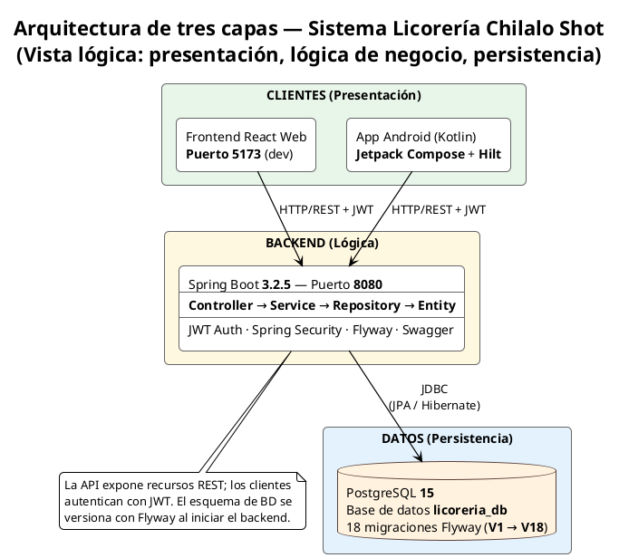

# CAPÍTULO IV: PROGRAMACIÓN

## Sistema Web y Aplicación Móvil para la Gestión Integral de la Licorería Chilalo Shot

---

## 4.1 Implementación de la Arquitectura de Software

### 4.1.1 Descripción general

El sistema sigue una **arquitectura de tres capas** distribuida en tres componentes independientes que se comunican entre sí a través de una API REST:

```
┌─────────────────────────────────────────────────────────────┐
│                    CLIENTES (Presentación)                   │
│  ┌──────────────────────┐    ┌──────────────────────────┐   │
│  │  Frontend React Web  │    │  App Android (Kotlin)    │   │
│  │  Puerto 5173 (dev)   │    │  Jetpack Compose + Hilt  │   │
│  └──────────┬───────────┘    └───────────┬──────────────┘   │
└─────────────┼──────────────────────────-─┼──────────────────┘
              │   HTTP/REST + JWT           │
┌─────────────┼─────────────────────────-──┼──────────────────┐
│             │     BACKEND (Lógica)        │                  │
│  ┌──────────▼─────────────────────────-──▼──────────┐       │
│  │          Spring Boot 3.2.5 – Puerto 8080          │       │
│  │  Controller → Service → Repository → Entity       │       │
│  │  JWT Auth · Spring Security · Flyway · Swagger    │       │
│  └──────────────────────┬────────────────────────────┘       │
└─────────────────────────┼──────────────────────────────────--┘
                          │   JDBC (JPA/Hibernate)
┌─────────────────────────┼────────────────────────────────────┐
│                         │   DATOS (Persistencia)             │
│  ┌──────────────────────▼────────────────────────────┐       │
│  │       PostgreSQL 15 – Base de datos licoreria_db   │       │
│  │       18 migraciones Flyway (V1 → V18)             │       │
│  └────────────────────────────────────────────────────┘       │
└────────────────────────────────────────────────────────────--┘
```

Equivalente en **PlantUML** (archivo fuente: `docs/ARQUITECTURA_TRES_CAPAS_CAPITULO_IV.puml`):



### 4.1.2 Descripción de cada componente

| Componente | Tecnología | Responsabilidad |
|---|---|---|
| **Frontend Web** | React 18 + TypeScript + Vite + Tailwind CSS | Interfaz de usuario para el administrador: POS, inventario, reportes, configuración, SUNAT |
| **App Android** | Kotlin + Jetpack Compose + Hilt + Retrofit | Interfaz móvil para vendedores: POS, consulta de productos, clientes y ventas |
| **Backend API** | Spring Boot 3.2.5, Java 17 | Lógica de negocio, autenticación JWT, integración SUNAT, generación de PDF |
| **Base de datos** | PostgreSQL 15 | Persistencia de todos los datos del negocio; migraciones versionadas con Flyway |

### 4.1.3 Patrón arquitectónico del Backend

El backend sigue estrictamente el patrón **Controller → Service → Repository → Entity**:

- **Controller**: Recibe peticiones HTTP, valida la entrada (`@Valid`) y delega al servicio. Retorna siempre `ApiResponse<T>` con estructura `{ success, data, message }`.
- **Service**: Contiene toda la lógica de negocio (cálculo de IGV, descuentos, promociones, validación de stock, fidelización). Anotado con `@Transactional`.
- **Repository**: Extiende `JpaRepository`. Contiene consultas JPQL o SQL nativo para filtros complejos.
- **Entity**: Clases JPA que mapean 1:1 con las tablas de la base de datos.

### 4.1.4 Seguridad y autenticación

La seguridad se implementa mediante **JWT stateless**:

- Token de acceso: 1 hora de duración.
- Token de refresco: 24 horas de duración.
- Roles: `ADMIN` y `VENDEDOR` con permisos diferenciados por endpoint.
- Contraseñas cifradas con **BCrypt (factor 10)**.

```java
// SecurityConfig.java – extracto de configuración
http
    .csrf(c -> c.disable())
    .sessionManagement(s -> s.sessionCreationPolicy(SessionCreationPolicy.STATELESS))
    .authorizeHttpRequests(a -> a
        .requestMatchers(PUBLIC).permitAll()
        .requestMatchers("/api/v1/usuarios/**").hasRole("ADMIN")
        .requestMatchers("/api/v1/reportes/**").hasRole("ADMIN")
        .requestMatchers("/api/v1/**").authenticated()
    )
    .addFilterBefore(jwtAuthFilter, UsernamePasswordAuthenticationFilter.class);
```

---

## 4.2 Creación de la Base de Datos

### 4.2.1 Diagrama Entidad-Relación (simplificado)

```
usuarios                    clientes
─────────────────           ─────────────────────
id (PK)                     id (PK)
username (UNIQUE)           tipo_documento
email (UNIQUE)              numero_documento (UNIQUE)
password                    nombre
nombre                      telefono
rol [ADMIN|VENDEDOR]        email
activo                      puntos_fidelizacion
                                    │
        ┌───────────────────────────┘
        │
ventas ─┴──────────────────────────────────────────────────────
id (PK)
numero_venta (UNIQUE)
fecha
usuario_id (FK → usuarios)
cliente_id (FK → clientes, nullable)
subtotal / descuento / impuesto / total
forma_pago [EFECTIVO|TARJETA|YAPE|PLIN|MIXTO|CREDITO|TRANSFERENCIA]
estado [COMPLETADA|ANULADA|PENDIENTE]
        │
        ├──── detalle_ventas ─────────────────────────────────
        │     id (PK)
        │     venta_id (FK → ventas)
        │     producto_id (FK → productos, nullable)
        │     pack_id (FK → packs, nullable)
        │     cantidad / precio_unitario / descuento / subtotal
        │
        └──── venta_pagos ────────────────────────────────────
              id (PK)
              venta_id (FK → ventas)
              forma_pago / monto

productos ─────────────────────────────────────────────────────
id (PK)
codigo_barras (UNIQUE)
nombre / marca
categoria_id (FK → categorias)
precio_compra / precio_venta
stock_actual / stock_minimo / stock_maximo
fecha_vencimiento
activo

categorias ────────────────────────────────────────────────────
id (PK)
nombre (UNIQUE)
descripcion
stock_minimo_default
activa

movimientos_inventario ────────────────────────────────────────
id (PK)
producto_id (FK → productos)
tipo [ENTRADA|SALIDA|AJUSTE]
cantidad / stock_anterior / stock_nuevo
motivo / referencia_id / referencia_tipo
usuario_id (FK → usuarios)
fecha

comprobantes_electronicos ─────────────────────────────────────
id (PK)
venta_id (FK → ventas)
tipo_comprobante [BOLETA|FACTURA|NOTA_CREDITO|NOTA_DEBITO]
serie / numero
xml_enviado / pdf_generado
estado_sunat [PENDIENTE|ACEPTADO|RECHAZADO|ERROR]

proveedores ───────────────────────────────────────────────────
id (PK)
razon_social / ruc (UNIQUE)
direccion / telefono / email / activo

compras ───────────────────────────────────────────────────────
id (PK)
numero_compra (UNIQUE)
proveedor_id (FK → proveedores)
usuario_id (FK → usuarios)
total / estado [PENDIENTE|RECIBIDA|COMPLETADA]

detalle_compras ───────────────────────────────────────────────
id (PK)
compra_id (FK → compras)
producto_id (FK → productos)
cantidad_pedida / cantidad_recibida / precio_unitario / subtotal

cuentas_por_cobrar ────────────────────────────────────────────
id (PK)
venta_id (FK → ventas)
cliente_id (FK → clientes)
monto_total / monto_pagado / saldo_pendiente
estado [PENDIENTE|PAGADA_PARCIAL|PAGADA|VENCIDA]
fecha_vencimiento

aperturas_caja ────────────────────────────────────────────────
id (PK)
usuario_id (FK → usuarios)
monto_apertura / monto_cierre
fecha_apertura / fecha_cierre
estado [ABIERTA|CERRADA]

gastos ────────────────────────────────────────────────────────
id (PK)
descripcion / categoria / monto
usuario_id (FK → usuarios)
fecha / comprobante

mermas ────────────────────────────────────────────────────────
id (PK)
producto_id (FK → productos)
cantidad / motivo / observaciones
usuario_id / fecha

config_fidelizacion ───────────────────────────────────────────
id (PK)
puntos_por_sol / soles_por_punto
puntos_max_por_venta / monto_minimo_canje
activo

puntos_movimientos ────────────────────────────────────────────
id (PK)
cliente_id (FK → clientes)
tipo [ACUMULACION|CANJE|AJUSTE]
puntos / saldo_anterior / saldo_nuevo
referencia_id / descripcion / fecha
```

### 4.2.2 Migraciones Flyway

El esquema se construye de forma incremental mediante 18 migraciones versionadas:

| Versión | Descripción |
|---|---|
| V1 | Esquema inicial: usuarios, categorias, productos, clientes, ventas, comprobantes, proveedores, compras |
| V2 | Triggers SQL para control de stock automático |
| V3 | Datos semilla: categorías, usuario admin, productos de ejemplo |
| V4 | Soporte de packs en detalle_ventas |
| V5 | Formas de pago Yape, Plin; tabla venta_pagos para pago mixto |
| V6–V7 | Correcciones en constraint de tipo de promociones |
| V8 | Stock mínimo por categoría |
| V9 | Eliminación de triggers de stock (manejo en código) |
| V10 | Categoría cigarros |
| V11 | Flujo compras PENDIENTE → RECIBIDA, recepción parcial |
| V12 | Devoluciones parciales con restauración de stock |
| V13 | Crédito/Fiado: forma de pago CREDITO + cuentas_por_cobrar |
| V14 | Apertura y cierre de caja |
| V15 | Gastos operativos |
| V16 | Mermas con 6 motivos predefinidos |
| V17 | Fidelización: acumulación de puntos y canje |
| V18 | Tokens para restablecimiento de contraseña |

### 4.2.3 Extracto del esquema SQL (tabla ventas)

```sql
CREATE TABLE ventas (
    id BIGSERIAL PRIMARY KEY,
    numero_venta VARCHAR(20) UNIQUE,
    fecha TIMESTAMP DEFAULT CURRENT_TIMESTAMP,
    usuario_id BIGINT REFERENCES usuarios(id) NOT NULL,
    cliente_id BIGINT REFERENCES clientes(id),
    subtotal DECIMAL(10,2) NOT NULL,
    descuento DECIMAL(10,2) DEFAULT 0,
    impuesto DECIMAL(10,2) DEFAULT 0,
    total DECIMAL(10,2) NOT NULL,
    forma_pago VARCHAR(20) NOT NULL
        CHECK (forma_pago IN ('EFECTIVO','TARJETA','TRANSFERENCIA',
                              'MIXTO','YAPE','PLIN','CREDITO')),
    estado VARCHAR(20) DEFAULT 'COMPLETADA'
        CHECK (estado IN ('COMPLETADA','ANULADA','PENDIENTE')),
    observaciones TEXT,
    fecha_creacion TIMESTAMP DEFAULT CURRENT_TIMESTAMP
);
CREATE INDEX idx_ventas_fecha ON ventas(fecha);
CREATE INDEX idx_ventas_usuario ON ventas(usuario_id);
CREATE INDEX idx_ventas_numero ON ventas(numero_venta);
```

---

## 4.3 Implementación de Librerías y Dependencias

### 4.3.1 Backend – Dependencias Maven (`pom.xml`)

| Librería | Versión | Uso |
|---|---|---|
| `spring-boot-starter-web` | 3.2.5 | API REST con Spring MVC |
| `spring-boot-starter-data-jpa` | 3.2.5 | ORM con Hibernate + repositorios |
| `spring-boot-starter-security` | 3.2.5 | Autenticación y autorización |
| `spring-boot-starter-validation` | 3.2.5 | Validación de DTOs (`@Valid`, `@NotNull`) |
| `postgresql` | runtime | Driver JDBC para PostgreSQL 15 |
| `jjwt-api / jjwt-impl / jjwt-jackson` | 0.12.5 | Generación y validación de tokens JWT |
| `springdoc-openapi-starter-webmvc-ui` | 2.5.0 | Documentación Swagger UI automática |
| `flyway-core` | incluido en BOM | Migraciones versionadas de base de datos |
| `flyway-database-postgresql` | 10.10.0 | Soporte específico PostgreSQL para Flyway |
| `openpdf` | 1.3.33 | Generación de reportes en formato PDF |
| `spring-boot-starter-mail` | 3.2.5 | Envío de correos (recuperación de contraseña) |
| `lombok` | incluido | Reducción de código boilerplate (`@Getter`, `@Builder`) |
| `spring-security-test` | test | Pruebas de seguridad con Spring |

### 4.3.2 Frontend Web – Dependencias npm (`package.json`)

| Librería | Versión | Uso |
|---|---|---|
| `react` + `react-dom` | 18.2.0 | Framework de interfaz de usuario |
| `react-router-dom` | 6.21.3 | Enrutamiento SPA con rutas protegidas |
| `tailwindcss` | 3.4.0 | Estilos utilitarios CSS |
| `recharts` | 2.10.4 | Gráficos de barras, líneas y torta para reportes |
| `lucide-react` | 0.309.0 | Biblioteca de iconos SVG |
| `clsx` + `tailwind-merge` | 2.x | Utilidades para combinar clases CSS condicionalmente |
| `typescript` | 5.3.3 | Tipado estático (devDependency) |
| `vite` | 5.0.12 | Servidor de desarrollo y bundler |
| `@vitejs/plugin-react` | 4.2.1 | Soporte React en Vite |

### 4.3.3 App Android – Dependencias Gradle (`build.gradle.kts`)

| Librería | Versión | Uso |
|---|---|---|
| `androidx.compose:compose-bom` | 2023.10.01 | BOM de Jetpack Compose (UI declarativa) |
| `material3` | BOM | Componentes Material Design 3 |
| `navigation-compose` | 2.7.5 | Navegación entre pantallas en Compose |
| `lifecycle-viewmodel-compose` | 2.6.2 | ViewModel integrado con Compose |
| `retrofit2` | 2.9.0 | Cliente HTTP para consumir la API REST |
| `converter-gson` | 2.9.0 | Serialización/deserialización JSON con Gson |
| `okhttp3` + `logging-interceptor` | 4.12.0 | HTTP client con logs de peticiones |
| `hilt-android` | 2.51.1 | Inyección de dependencias (DI) |
| `hilt-navigation-compose` | 1.1.0 | Integración Hilt con Navigation Compose |
| `datastore-preferences` | 1.0.0 | Almacenamiento persistente de tokens |
| `kotlinx-coroutines-android` | 1.7.3 | Programación asíncrona con corrutinas |
| `camera-camera2 / camera-lifecycle / camera-view` | 1.3.1 | Acceso a cámara para escaneo de códigos |
| `mlkit:barcode-scanning` | 17.2.0 | Lectura de códigos de barras con ML Kit |

---

## 4.4 Codificación del Back End

### 4.4.1 Estructura de paquetes

```
com.licoreria/
├── config/          → SecurityConfig, CorsConfig, JwtProperties, OpenApiConfig
├── controller/      → AuthController, VentaController, ProductoController,
│                      InventarioController, ReporteController, ClienteController,
│                      CompraController, DevolucionController, CajaController,
│                      GastoController, MermaController, FidelizacionController,
│                      FacturacionController, PackController, PromocionController
├── service/         → VentaService, ReporteService, InventarioService,
│                      ProductoService, FacturacionService, FidelizacionService, ...
├── repository/      → VentaRepository, ProductoRepository, ClienteRepository, ...
├── entity/          → Venta, Producto, Cliente, Usuario, DetalleVenta, ...
├── dto/             → ApiResponse, VentaDTO, ProductoDTO, CierreCajaDTO, ...
└── security/        → JwtService, JwtAuthFilter, UserDetailsServiceImpl
```

### 4.4.2 Wrapper de respuesta API

Todas las respuestas del backend siguen un formato estándar `ApiResponse<T>`:

```java
// ApiResponse.java
public class ApiResponse<T> {
    private boolean success;
    private T data;
    private String message;
    private ErrorInfo error;

    public static <T> ApiResponse<T> ok(T data) {
        ApiResponse<T> res = new ApiResponse<>();
        res.success = true;
        res.data = data;
        return res;
    }

    public static <T> ApiResponse<T> error(String code, String message) {
        ApiResponse<T> res = new ApiResponse<>();
        res.success = false;
        res.error = new ErrorInfo(code, message);
        return res;
    }
}
```

### 4.4.3 Controlador de Ventas

```java
@RestController
@RequestMapping("/api/v1/ventas")
@RequiredArgsConstructor
@Tag(name = "Ventas", description = "API para gestión de ventas")
public class VentaController {

    private final VentaService ventaService;

    @PostMapping
    public ResponseEntity<ApiResponse<VentaDTO>> crear(
            @Valid @RequestBody CrearVentaRequest request) {
        return ResponseEntity.ok(ventaService.crear(request));
    }

    @GetMapping
    public ResponseEntity<ApiResponse<Page<VentaDTO>>> listar(
            @RequestParam(required = false) Instant fechaDesde,
            @RequestParam(required = false) Instant fechaHasta,
            @RequestParam(required = false) String estado,
            Pageable pageable) {
        return ResponseEntity.ok(
            ventaService.listar(fechaDesde, fechaHasta, null, null, estado, pageable));
    }

    @GetMapping("/cierre-caja")
    public ResponseEntity<ApiResponse<CierreCajaDTO>> cierreCaja(
            @RequestParam(required = false) LocalDate fecha) {
        if (fecha == null) fecha = LocalDate.now();
        return ResponseEntity.ok(ApiResponse.ok(ventaService.getCierreCaja(fecha)));
    }

    @PutMapping("/{id}/anular")
    public ResponseEntity<ApiResponse<VentaDTO>> anular(
            @PathVariable Long id,
            @RequestParam(defaultValue = "Anulación por administrador") String motivo) {
        return ResponseEntity.ok(ventaService.anular(id, motivo));
    }
}
```

### 4.4.4 Lógica transaccional de Venta (VentaService)

El método `crear()` del `VentaService` implementa la lógica completa de una venta:

```java
@Transactional
public ApiResponse<VentaDTO> crear(CrearVentaRequest request) {
    // 1. Obtener usuario autenticado del contexto de seguridad
    Authentication auth = SecurityContextHolder.getContext().getAuthentication();
    Usuario usuario = usuarioRepository.findByUsername(auth.getName())
            .orElseThrow(() -> new RuntimeException("Usuario no encontrado"));

    // 2. Validar cliente opcional
    Cliente cliente = null;
    if (request.getClienteId() != null) {
        cliente = clienteRepository.findById(request.getClienteId())
                .orElseThrow(() -> new RuntimeException("Cliente no encontrado"));
    }

    // 3. Procesar ítems: validar stock y construir detalles
    List<DetalleVenta> detalles = new ArrayList<>();
    BigDecimal subtotal = BigDecimal.ZERO;

    for (CrearVentaRequest.ItemVenta item : request.getItems()) {
        Producto producto = productoRepository.findById(item.getProductoId())
                .orElseThrow(() -> new RuntimeException("Producto no encontrado"));

        if (producto.getStockActual() < item.getCantidad()) {
            return ApiResponse.error("INSUFFICIENT_STOCK",
                "Stock insuficiente para " + producto.getNombre());
        }

        BigDecimal subtotalItem = producto.getPrecioVenta()
                .multiply(new BigDecimal(item.getCantidad()));
        subtotal = subtotal.add(subtotalItem);
        // ... construir DetalleVenta y descontar stock
    }

    // 4. Aplicar descuento general + canje de puntos de fidelización
    BigDecimal descuento = request.getDescuento() != null
            ? request.getDescuento() : BigDecimal.ZERO;

    // 5. Calcular IGV (18%) si aplica
    boolean aplicarIgv = Boolean.TRUE.equals(request.getAplicarIgv());
    BigDecimal impuesto = aplicarIgv
            ? subtotal.subtract(descuento).multiply(new BigDecimal("0.18"))
            : BigDecimal.ZERO;

    // 6. Persistir venta + detalles + movimientos de inventario
    // 7. Acumular puntos de fidelización si hay cliente
    // 8. Registrar en cuentas_por_cobrar si forma de pago es CREDITO
    // 9. Retornar DTO de la venta creada
}
```

### 4.4.5 Configuración de seguridad (SecurityConfig)

```java
@Configuration
@EnableWebSecurity
@EnableMethodSecurity
public class SecurityConfig {

    @Bean
    public SecurityFilterChain filterChain(HttpSecurity http) throws Exception {
        http
            .csrf(c -> c.disable())
            .sessionManagement(s ->
                s.sessionCreationPolicy(SessionCreationPolicy.STATELESS))
            .authorizeHttpRequests(a -> a
                .requestMatchers(PUBLIC).permitAll()
                // Solo ADMIN puede gestionar usuarios, compras, reportes
                .requestMatchers("/api/v1/usuarios/**").hasRole("ADMIN")
                .requestMatchers("/api/v1/reportes/**").hasRole("ADMIN")
                // Escritura de catálogo solo ADMIN
                .requestMatchers(HttpMethod.POST, "/api/v1/productos/**").hasRole("ADMIN")
                .requestMatchers(HttpMethod.PUT,  "/api/v1/productos/**").hasRole("ADMIN")
                // Todo lo demás: autenticado
                .requestMatchers("/api/v1/**").authenticated()
            )
            .addFilterBefore(jwtAuthFilter, UsernamePasswordAuthenticationFilter.class);
        return http.build();
    }

    @Bean
    public PasswordEncoder passwordEncoder() {
        return new BCryptPasswordEncoder(10);
    }
}
```

---

## 4.5 Codificación del Front End

### 4.5.1 Estructura del proyecto React

```
frontend/src/
├── api/
│   ├── api.ts        → Funciones de llamada a todos los endpoints
│   └── client.ts     → Axios/fetch base con interceptores JWT
├── context/
│   ├── AuthContext.tsx           → Estado global de autenticación
│   └── NotificacionesContext.tsx → Alertas de stock bajo
├── components/
│   ├── layout/
│   │   ├── MainLayout.tsx    → Shell principal (Sidebar + Header)
│   │   ├── Sidebar.tsx       → Menú de navegación lateral
│   │   └── Header.tsx        → Barra superior con usuario y notificaciones
│   ├── ui/
│   │   ├── Button.tsx  → Botón reutilizable con variantes
│   │   ├── Card.tsx    → Tarjeta con CardHeader / CardContent
│   │   └── Input.tsx   → Campo de texto estilizado
│   └── settings/       → Componentes del panel de configuración
├── pages/
│   ├── Login.tsx          → Pantalla de inicio de sesión
│   ├── Dashboard.tsx      → KPIs principales del negocio
│   ├── POS.tsx            → Punto de venta (módulo principal)
│   ├── Products.tsx       → CRUD de productos
│   ├── Inventory.tsx      → Alertas y movimientos de inventario
│   ├── Ventas.tsx         → Historial de ventas con filtros
│   ├── Reports.tsx        → Reportes con gráficos (Recharts)
│   ├── Clientes.tsx       → Gestión de clientes
│   ├── Compras.tsx        → Gestión de compras a proveedores
│   ├── CierreCaja.tsx     → Resumen de caja del día
│   ├── Devoluciones.tsx   → Registro de devoluciones
│   ├── Gastos.tsx         → Control de gastos operativos
│   └── Settings.tsx       → Configuración general del sistema
└── App.tsx                → Router principal con rutas protegidas
```

### 4.5.2 Gestión de autenticación (AuthContext)

```typescript
// context/AuthContext.tsx
export function AuthProvider({ children }: { children: React.ReactNode }) {
  const [user, setUser] = useState<User>(getStoredUser);
  const [token, setToken] = useState<string | null>(
    () => localStorage.getItem('access_token')
  );

  const login = useCallback(async (username: string, password: string) => {
    const res = await apiLogin(username, password);
    if (!res.success || !res.data) {
      return { success: false, message: res.error?.message };
    }
    const { accessToken, refreshToken, user: userData } = res.data;
    localStorage.setItem('access_token', accessToken);
    localStorage.setItem('refresh_token', refreshToken);
    localStorage.setItem('user', JSON.stringify(userData));
    setToken(accessToken);
    setUser(userData);
    return { success: true };
  }, []);

  const logout = useCallback(() => {
    localStorage.clear();
    setToken(null);
    setUser(null);
  }, [token]);

  return (
    <AuthContext.Provider value={{ user, token, isAuthenticated: !!token, login, logout }}>
      {children}
    </AuthContext.Provider>
  );
}
```

### 4.5.3 Pantalla POS – Definición de tipos y formas de pago

```typescript
// pages/POS.tsx – tipos y constantes del módulo de ventas
type FormaPago = 'EFECTIVO' | 'TARJETA' | 'YAPE' | 'PLIN' | 'MIXTO' | 'CREDITO';

interface CartItem {
  producto?: ProductoDTO;
  packId?: number;
  packNombre?: string;
  packProductos?: { productoNombre: string; cantidad: number }[];
  cantidad: number;
  precioUnitario: number;
}

const FORMAS_PAGO = [
  { value: 'EFECTIVO', label: 'Efectivo',       color: 'bg-green-100 text-green-800' },
  { value: 'TARJETA',  label: 'Tarjeta',        color: 'bg-blue-100 text-blue-800'  },
  { value: 'YAPE',     label: 'Yape',           color: 'bg-purple-100 text-purple-800' },
  { value: 'PLIN',     label: 'Plin',           color: 'bg-teal-100 text-teal-800'  },
  { value: 'MIXTO',    label: 'Mixto',          color: 'bg-orange-100 text-orange-800' },
  { value: 'CREDITO',  label: 'Crédito/Fiado',  color: 'bg-yellow-100 text-yellow-800' },
];

const IGV = 0.18;
```

### 4.5.4 Pantalla de Productos (CRUD)

```typescript
// pages/Products.tsx – carga de datos con filtros
const load = async () => {
  setLoading(true);
  const [prodRes, catRes] = await Promise.all([
    fetchProductos({
      search: searchTerm || undefined,
      categoriaId: categoriaId || undefined,
      page,
      size: 20,
      activo: true,
    }),
    fetchCategorias(false),
  ]);
  if (prodRes.success && prodRes.data) {
    setItems(prodRes.data.content ?? []);
    setTotalElements(prodRes.data.totalElements ?? 0);
  }
  if (catRes.success && catRes.data) setCategorias(catRes.data);
  setLoading(false);
};

useEffect(() => { load(); }, [searchTerm, categoriaId, page]);
```

### 4.5.5 Router principal con rutas protegidas

```typescript
// App.tsx
function App() {
  return (
    <AuthProvider>
      <Router>
        <Routes>
          <Route path="/login" element={<Login />} />
          <Route path="/forgot-password" element={<ForgotPassword />} />
          <Route element={<ProtectedRoute />}>
            <Route element={<MainLayout />}>
              <Route path="/"           element={<Dashboard />} />
              <Route path="/pos"        element={<POS />} />
              <Route path="/productos"  element={<Products />} />
              <Route path="/inventario" element={<Inventory />} />
              <Route path="/ventas"     element={<Ventas />} />
              <Route path="/reportes"   element={<Reports />} />
              <Route path="/clientes"   element={<Clientes />} />
              <Route path="/compras"    element={<Compras />} />
              <Route path="/cierre-caja" element={<CierreCaja />} />
              <Route path="/gastos"     element={<Gastos />} />
              <Route path="/settings"   element={<Settings />} />
            </Route>
          </Route>
        </Routes>
      </Router>
    </AuthProvider>
  );
}
```

---

## 4.6 Codificación de Consultas y Reportes

### 4.6.1 Endpoints de reportes disponibles

| Endpoint | Método | Descripción |
|---|---|---|
| `GET /api/v1/reportes/dashboard` | GET | KPIs del día: ventas, ganancias, alertas de stock |
| `GET /api/v1/reportes/ventas` | GET | Reporte de ventas por rango de fechas y agrupación (DIA/SEMANA/MES) |
| `GET /api/v1/reportes/ventas/pdf` | GET | Descarga reporte de ventas en PDF |
| `GET /api/v1/reportes/productos-mas-vendidos` | GET | Top N productos más vendidos en un período |
| `GET /api/v1/reportes/inventario` | GET | Estado del inventario con alertas |
| `GET /api/v1/reportes/inventario/pdf` | GET | Descarga reporte de inventario en PDF |
| `GET /api/v1/ventas/cierre-caja` | GET | Resumen diario: total, desglose por forma de pago, ganancias netas |

### 4.6.2 Cálculo de Dashboard (ReporteService)

```java
@Transactional(readOnly = true)
public DashboardDTO obtenerDashboard() {
    LocalDate hoy = LocalDate.now();
    ReporteVentasDTO ventasHoy = obtenerReporteVentas(hoy, hoy, "DIA");
    ReporteInventarioDTO inventario = obtenerReporteInventario();

    // Calcular ganancias del día (precio venta - precio compra)
    Instant desde = hoy.atStartOfDay(ZoneId.systemDefault()).toInstant();
    Instant hasta = hoy.plusDays(1).atStartOfDay(ZoneId.systemDefault()).toInstant();
    List<Venta> ventasConDetalles = ventaRepository
            .findByFechaBetweenWithDetalles(desde, hasta);

    BigDecimal gananciasHoy = BigDecimal.ZERO;
    for (Venta v : ventasConDetalles) {
        if (v.getEstado() != Venta.Estado.COMPLETADA) continue;
        for (DetalleVenta d : v.getDetalles()) {
            BigDecimal costo = d.getProducto().getPrecioCompra() != null
                    ? d.getProducto().getPrecioCompra() : BigDecimal.ZERO;
            BigDecimal margen = d.getPrecioUnitario().subtract(costo);
            gananciasHoy = gananciasHoy.add(
                    margen.multiply(BigDecimal.valueOf(d.getCantidad())));
        }
    }

    DashboardDTO dto = new DashboardDTO();
    dto.setVentasHoy(ventasHoy.getTotalVentas());
    dto.setGananciasHoy(gananciasHoy);
    dto.setTransaccionesHoy(ventasHoy.getTotalTransacciones());
    dto.setProductosActivos(inventario.getProductosActivos());
    dto.setProductosStockBajo(inventario.getProductosStockBajo());
    dto.setProductosProximosVencer(inventario.getProductosProximosVencer());
    return dto;
}
```

### 4.6.3 Gráficos de reportes en el Frontend (Recharts)

```typescript
// pages/Reports.tsx – gráfico de barras de ventas por período
<ResponsiveContainer width="100%" height={300}>
  <BarChart data={reporte?.ventasPorPeriodo ?? []}>
    <CartesianGrid strokeDasharray="3 3" />
    <XAxis dataKey="periodo" tickFormatter={formatDate} />
    <YAxis tickFormatter={v => `S/${v}`} />
    <Tooltip content={<BarTooltip />} />
    <Bar dataKey="totalVentas" fill="#2563EB" radius={[6, 6, 0, 0]} />
  </BarChart>
</ResponsiveContainer>

// Gráfico pie – ventas por categoría
<PieChart>
  <Pie
    data={reporte?.ventasPorCategoria ?? []}
    dataKey="totalVentas"
    nameKey="categoria"
    cx="50%" cy="50%"
    outerRadius={100}
    label={({ name, percent }) =>
      `${name} ${(percent * 100).toFixed(0)}%`}
  >
    {(reporte?.ventasPorCategoria ?? []).map((_, i) => (
      <Cell key={i} fill={COLORS[i % COLORS.length]} />
    ))}
  </Pie>
  <Tooltip content={<PieTooltip />} />
  <Legend />
</PieChart>
```

### 4.6.4 Generación de PDF con OpenPDF (ReporteService)

```java
public byte[] generarReporteVentasPDF(LocalDate fechaInicio, LocalDate fechaFin)
        throws DocumentException {
    ByteArrayOutputStream baos = new ByteArrayOutputStream();
    Document document = new Document(PageSize.A4, 40, 40, 60, 40);
    PdfWriter.getInstance(document, baos);
    document.open();

    // Encabezado
    Font titleFont = FontFactory.getFont(FontFactory.HELVETICA_BOLD, 16);
    document.add(new Paragraph("Reporte de Ventas – Licorería Chilalo Shot", titleFont));
    document.add(new Paragraph("Período: " + fechaInicio + " al " + fechaFin));
    document.add(Chunk.NEWLINE);

    // Tabla de datos
    PdfPTable table = new PdfPTable(4);
    table.setWidthPercentage(100);
    String[] headers = {"Período", "N° Ventas", "Total (S/)", "Promedio (S/)"};
    for (String h : headers) {
        PdfPCell cell = new PdfPCell(new Phrase(h,
                FontFactory.getFont(FontFactory.HELVETICA_BOLD, 10)));
        table.addCell(cell);
    }
    // ... agregar filas con datos
    document.add(table);
    document.close();
    return baos.toByteArray();
}
```

---

## 4.7 Codificación de Mantenedores (CRUD) y Procesos Transaccionales

### 4.7.1 CRUD de Productos (Backend)

El controlador `ProductoController` expone operaciones completas con eliminación lógica:

```java
// Crear producto
@PostMapping
public ResponseEntity<ApiResponse<ProductoDTO>> crear(
        @Valid @RequestBody ProductoDTO dto) {
    ApiResponse<ProductoDTO> res = productoService.crear(dto);
    if ("CONFLICT".equals(res.getError() != null ? res.getError().getCode() : null))
        return ResponseEntity.status(HttpStatus.CONFLICT).body(res);
    return ResponseEntity.status(HttpStatus.CREATED).body(res);
}

// Actualizar producto
@PutMapping("/{id}")
public ResponseEntity<ApiResponse<ProductoDTO>> actualizar(
        @PathVariable Long id, @Valid @RequestBody ProductoDTO dto) {
    return ResponseEntity.ok(productoService.actualizar(id, dto));
}

// Eliminar producto (lógico: activo = false)
@DeleteMapping("/{id}")
public ResponseEntity<ApiResponse<Void>> eliminar(@PathVariable Long id) {
    return ResponseEntity.ok(productoService.eliminar(id));
}

// Eliminar en lote
@PostMapping("/bulk-delete")
public ResponseEntity<ApiResponse<Void>> eliminarBulk(
        @RequestBody List<Long> ids) {
    return ResponseEntity.ok(productoService.eliminarBulk(ids));
}

// Importar desde CSV
@PostMapping("/importar")
public ResponseEntity<ApiResponse<ImportarProductosResultDTO>> importar(
        @RequestParam("archivo") MultipartFile archivo) throws IOException {
    String csvContent = new String(archivo.getBytes(), StandardCharsets.UTF_8);
    return ResponseEntity.ok(productoService.importarDesdeCsv(csvContent));
}
```

### 4.7.2 CRUD de Productos (Frontend – Products.tsx)

```typescript
// Guardar (crear o actualizar)
const handleSave = async () => {
  setSaving(true);
  setError(null);
  const payload = {
    nombre: form.nombre,
    codigoBarras: form.codigoBarras || null,
    marca: form.marca || null,
    categoriaId: form.categoriaId || null,
    precioCompra: parseFloat(form.precioCompra) || null,
    precioVenta: parseFloat(form.precioVenta),
    stockInicial: parseInt(form.stockInicial) || 0,
    stockMinimo: parseInt(form.stockMinimo) || 0,
    activo: form.activo,
  };

  const res = editId
    ? await actualizarProducto(editId, payload)
    : await crearProducto(payload);

  if (!res.success) {
    setError(res.error?.message || 'Error al guardar');
    setSaving(false);
    return;
  }
  setModalOpen(false);
  load();
};

// Eliminar en lote
const handleBulkDelete = async () => {
  if (selected.size === 0) return;
  setEliminandoBulk(true);
  await eliminarProductosBulk([...selected]);
  setEliminandoBulk(false);
  load();
};
```

### 4.7.3 Proceso transaccional: Anulación de Venta

La anulación de una venta restaura el stock de todos los productos involucrados:

```java
@Transactional
public ApiResponse<VentaDTO> anular(Long id, String motivo) {
    Venta venta = ventaRepository.findById(id)
            .orElseThrow(() -> new RuntimeException("Venta no encontrada"));

    if (venta.getEstado() == Venta.Estado.ANULADA) {
        return ApiResponse.error("ALREADY_CANCELLED", "La venta ya está anulada");
    }

    // Restaurar stock para cada producto del detalle
    for (DetalleVenta detalle : venta.getDetalles()) {
        if (detalle.getProducto() != null) {
            Producto p = detalle.getProducto();
            int stockAnterior = p.getStockActual();
            p.setStockActual(p.getStockActual() + detalle.getCantidad());
            productoRepository.save(p);

            // Registrar movimiento de inventario tipo ENTRADA
            MovimientoInventario mov = MovimientoInventario.builder()
                    .producto(p)
                    .tipo(MovimientoInventario.Tipo.ENTRADA)
                    .cantidad(detalle.getCantidad())
                    .stockAnterior(stockAnterior)
                    .stockNuevo(p.getStockActual())
                    .motivo("Anulación de venta " + venta.getNumeroVenta() + ": " + motivo)
                    .build();
            movimientoInventarioRepository.save(mov);
        }
    }

    venta.setEstado(Venta.Estado.ANULADA);
    venta.setObservaciones(motivo);
    ventaRepository.save(venta);

    return ApiResponse.ok(toDTO(venta));
}
```

### 4.7.4 Proceso transaccional: Apertura y Cierre de Caja

```java
// CajaController.java – endpoints de caja
@PostMapping("/abrir")
public ResponseEntity<ApiResponse<AperturaCajaDTO>> abrir(
        @Valid @RequestBody AbrirCajaRequest request) {
    return ResponseEntity.ok(cajaService.abrir(request));
}

@PostMapping("/{id}/cerrar")
public ResponseEntity<ApiResponse<AperturaCajaDTO>> cerrar(
        @PathVariable Long id,
        @Valid @RequestBody CerrarCajaRequest request) {
    return ResponseEntity.ok(cajaService.cerrar(id, request));
}
```

### 4.7.5 Proceso transaccional: Devoluciones

```java
// DevolucionController.java
@PostMapping
@Operation(summary = "Registrar devolución parcial o total de una venta")
public ResponseEntity<ApiResponse<DevolucionDTO>> crear(
        @Valid @RequestBody CrearDevolucionRequest request) {
    // Valida los ítems, restaura stock, registra MovimientoInventario tipo ENTRADA
    // y genera un registro en la tabla devoluciones
    return ResponseEntity.ok(devolucionService.crear(request));
}
```

### 4.7.6 Proceso transaccional: Acumulación y Canje de Puntos (Fidelización)

```java
// FidelizacionService.java – acumulación automática en cada venta
@Transactional
public void acumularPuntos(Cliente cliente, BigDecimal totalVenta, Long ventaId) {
    ConfigFidelizacion config = getConfig();
    if (!config.getActivo()) return;

    // Calcular puntos: 1 punto por cada S/5 de compra (configurable)
    int puntos = totalVenta
            .divide(config.getPuntosPorSol(), 0, RoundingMode.DOWN)
            .min(BigDecimal.valueOf(config.getPuntosMaxPorVenta()))
            .intValue();

    int saldoAnterior = cliente.getPuntosFidelizacion();
    cliente.setPuntosFidelizacion(saldoAnterior + puntos);
    clienteRepository.save(cliente);

    // Registrar movimiento de puntos
    PuntosMovimiento mov = new PuntosMovimiento();
    mov.setCliente(cliente);
    mov.setTipo(PuntosMovimiento.Tipo.ACUMULACION);
    mov.setPuntos(puntos);
    mov.setSaldoAnterior(saldoAnterior);
    mov.setSaldoNuevo(cliente.getPuntosFidelizacion());
    mov.setReferenciaId(ventaId);
    puntosMovimientoRepository.save(mov);
}
```

### 4.7.7 Módulo POS Android (Kotlin + Jetpack Compose)

```kotlin
// POSViewModel.kt – confirmar venta desde app móvil
fun confirmarVenta() {
    if (_cartItems.value.isEmpty()) return
    viewModelScope.launch {
        _ventaState.value = VentaState.Loading
        val items = _cartItems.value.map { item ->
            DetalleVentaRequestDto(
                productoId = item.producto.id,
                cantidad = item.cantidad
            )
        }
        val request = CrearVentaRequestDto(
            items = items,
            clienteId = _selectedCliente.value?.id,
            descuento = _descuento.value,
            formaPago = _formaPago.value.name,
            aplicarIgv = false
        )
        posRepository.crearVenta(request).fold(
            onSuccess = { venta ->
                _ventaState.value = VentaState.Success(venta)
                _cartItems.value = emptyList()
            },
            onFailure = { error ->
                _ventaState.value = VentaState.Error(error.message ?: "Error al procesar venta")
            }
        )
    }
}
```

---

*Documento generado para el Trabajo de Aplicación de Asignatura (TAA) – Licorería Chilalo Shot, Piura. Abril 2026.*
