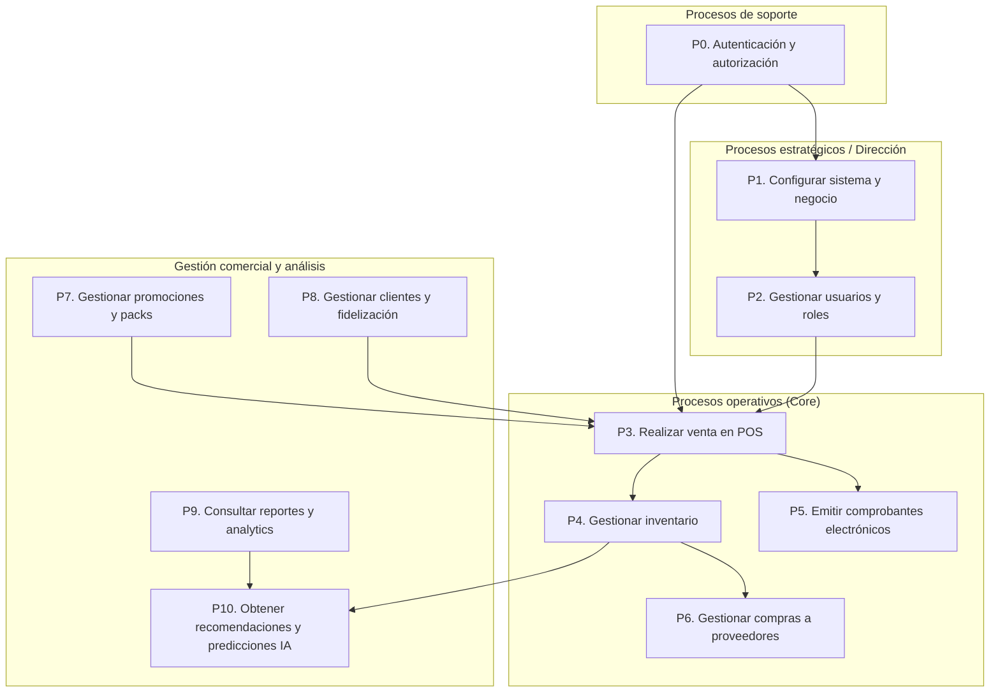

# MAPA DE PROCESOS DEL PROYECTO
## Sistema Web y App Móvil con IA para Gestión Integral de Licorería (Chilalo Shot)

**Proyecto:** PROY-LICOR-PIURA-2025-001 / Chilalo Shot  
**Versión:** 1.0  
**Fecha:** Febrero 2025

---

## 1. INTRODUCCIÓN

### 1.1 Propósito

Este documento presenta el **mapa de procesos** del Sistema de Gestión Integral de Licorería: procesos de negocio que el sistema soporta, sus relaciones y actores. Sirve como referencia para alcance funcional, diseño de flujos y validación con el cliente.

### 1.2 Alcance

- **Incluye:** Procesos estratégicos, operativos (core), gestión comercial, análisis e IA, y soporte.
- **Contexto:** Licorería pequeña en Piura (1–2 empleados); sistema Web + POS + integración SUNAT e IA.

---

## 2. CLASIFICACIÓN DE PROCESOS

| Nivel | Tipo | Descripción |
|-------|------|-------------|
| **1** | **Estratégicos / Dirección** | Configuración del negocio, usuarios y parámetros. |
| **2** | **Operativos (Core)** | Venta, inventario, facturación, compras. |
| **3** | **Gestión comercial y análisis** | Promociones, clientes, fidelización, reportes e IA. |
| **4** | **Soporte** | Autenticación, seguridad y soporte operativo. |

---

## 3. MAPA DE PROCESOS – VISTA GENERAL

El diagrama en **PlantUML** está en el archivo `MAPA_PROCESOS_VISTA_GENERAL.puml`. Puedes abrirlo en [plantuml.com](https://www.plantuml.com/plantuml/uml) o con cualquier visor/plugin PlantUML.

### 3.1 PlantUML (vista general)

Ver archivo: **`docs/MAPA_PROCESOS_VISTA_GENERAL.puml`**

### 3.2 Mermaid (alternativa)

---

## 4. ARCHIVOS DEL MAPA DE PROCESOS (CONSERVAR)

| Archivo | Descripción |
|---------|-------------|
| **`docs/MAPA_PROCESOS_PROYECTO.md`** | Documento principal: clasificación, descripción de procesos P0–P10, matriz proceso-actor, relación con CUN. |
| **`docs/MAPA_PROCESOS_VISTA_GENERAL.puml`** | Diagrama PlantUML del mapa de procesos (vista general). |
| **`docs/MAPA_PROCESO_OPERATIVO_REALIZAR_VENTA.md`** | Proceso operativo Realizar venta en POS: etapas, entradas/salidas, excepciones. |
| **`docs/MAPA_PROCESO_OPERATIVO_REALIZAR_VENTA.puml`** | Diagrama PlantUML del proceso operativo Realizar venta (actividades, pistas Vendedor/Sistema). |
| **`docs/MAPAS_DE_PROCESOS_INDICE.md`** | Índice y referencia de todos los archivos de mapas de procesos. |

**Importante:** Conservar estos archivos como parte de la documentación oficial del proyecto (Chilalo Shot / PIDS3).

---

## 5. DESCRIPCIÓN RESUMIDA DE PROCESOS

- **P0.** Autenticación y autorización (Soporte): login, JWT, roles.
- **P1.** Configurar sistema y negocio: datos del establecimiento, SUNAT/OSE, impresoras.
- **P2.** Gestionar usuarios y roles: Administrador, Vendedor, permisos.
- **P3.** Realizar venta en POS: carrito, promociones, pago, comprobante; actualiza inventario.
- **P4.** Gestionar inventario: catálogo, stock, alertas, movimientos.
- **P5.** Emitir comprobantes electrónicos: boletas/facturas vía OSE/SUNAT, XML, PDF, RCB.
- **P6.** Gestionar compras a proveedores: registro de compras, actualización de stock y precios.
- **P7.** Gestionar promociones y packs: descuentos, 2x1, packs; aplicación en POS.
- **P8.** Gestionar clientes y fidelización: registro, historial, puntos y canje.
- **P9.** Consultar reportes y analytics: dashboard, reportes por período, exportación, insights IA.
- **P10.** Obtener recomendaciones y predicciones IA: sugerencias en venta, predicción de demanda, sugerencias de promociones.

---

## 6. MATRIZ PROCESO – ACTOR

| Proceso | Dueño/Admin | Vendedor | Cliente | Sistema (IA) | SUNAT |
|---------|-------------|----------|---------|----------------|-------|
| P0. Autenticación | ● | ● | — | ● | — |
| P1. Configurar sistema | ● | — | — | — | — |
| P2. Usuarios y roles | ● | — | — | — | — |
| P3. Realizar venta POS | ● | ● | ○ | ○ | — |
| P4. Gestionar inventario | ● | ○ | — | ○ | — |
| P5. Comprobantes electrónicos | ● | ○ | — | — | ● |
| P6. Compras | ● | — | — | ○ | — |
| P7. Promociones y packs | ● | ○ | — | ○ | — |
| P8. Clientes y fidelización | ● | ● | ○ | ○ | — |
| P9. Reportes y analytics | ● | — | — | ● | — |
| P10. IA | ○ | ○ | — | ● | — |

**Leyenda:** ● Responsable / Ejecuta; ○ Participa / Consulta / Recibe.

---

## 7. RELACIÓN CON CUN (FICHA_03)

| Proceso | CUN |
|---------|-----|
| P3 | Realizar venta en punto de venta (POS) |
| P4 | Gestionar inventario |
| P5 | Emitir comprobantes electrónicos |
| P7 | Gestionar promociones y packs |
| P8 | Gestionar clientes y fidelización |
| P9 | Consultar reportes y analytics |
| P10 | Obtener recomendaciones y predicciones de IA |

---

**Documento elaborado por:** Equipo de Desarrollo – Proyecto Chilalo Shot  
**Versión:** 1.0  
**Referencias:** Acta de Constitución, Requerimientos Detallados (semana-01), FICHA_03 (CUN).
