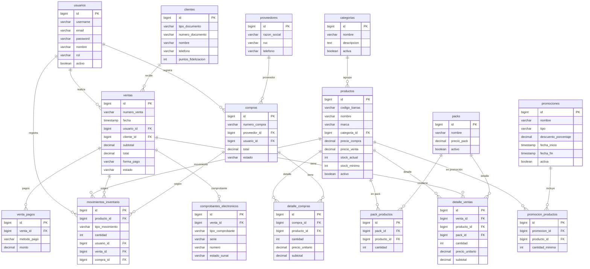
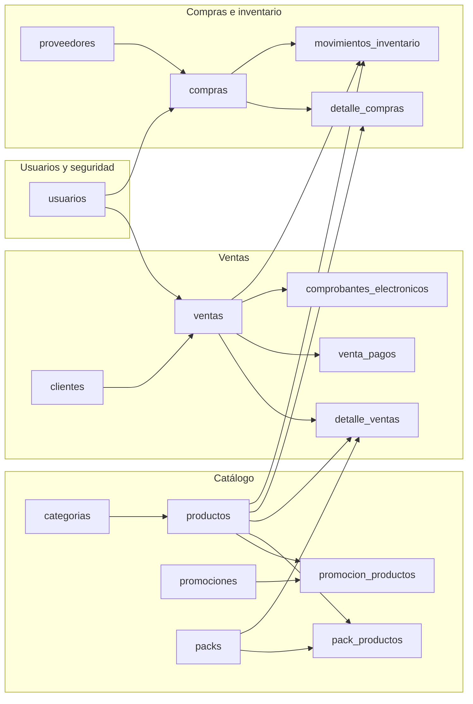

# Diagrama de esquema de base de datos - Licorería Piura

Puedes ver este diagrama en:
- **Cursor/VS Code:** instala la extensión "Mermaid" o "Markdown Preview Mermaid Support" y abre la vista previa (Ctrl+Shift+V).
- **Web:** copia el código en [mermaid.live](https://mermaid.live) y verás el diagrama interactivo.
- **GitHub:** al subir el repo, GitHub renderiza Mermaid en los `.md`.

---

## Diagrama ER (tablas y relaciones)

---

## Vista simplificada (solo tablas y relaciones)

